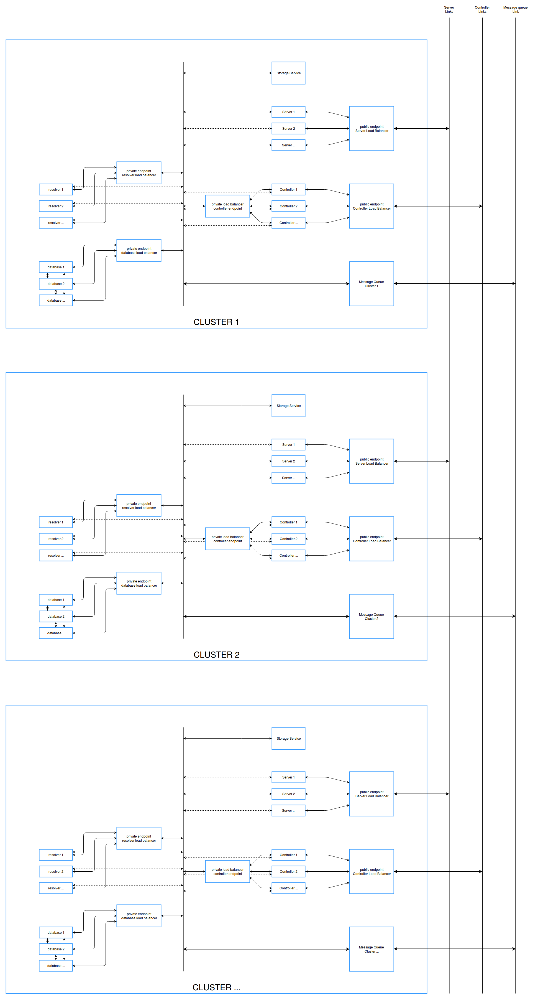
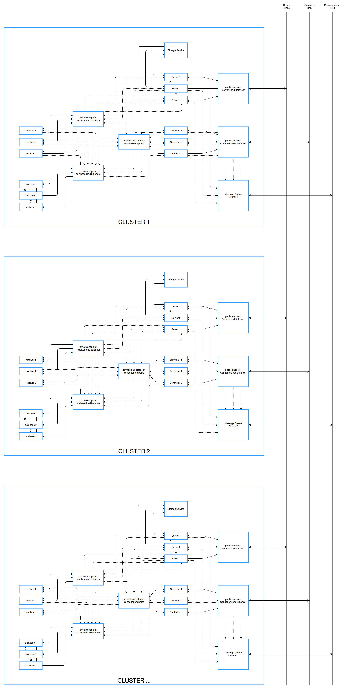
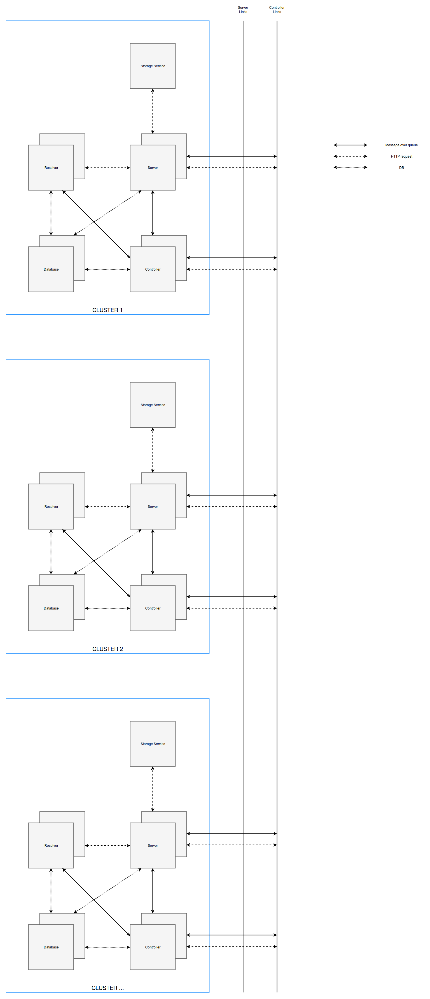

# MCOS High Availability - Scalable Cluster Architecture

## Kiến trúc hệ thống

- [mcos_ha_1.png](./images/mcos_ha/mcos_ha_1.png)



- [mcos_ha_2.png](./images/mcos_ha/mcos_ha_2.png)



- [mcos_ha_3.png](./images/mcos_ha/mcos_ha_3.png)



Mỗi một cluster có một message queue cho phép truyền message giữa các service cũng như giữa các service của cluster này vói các service của cluster khác

## Vai trò của từng thành phần trong thiết kế

- Controller - Service quản lý cluster:
    - Là endpoint để các service khác register vào cluster.
    - Quản lý và kiểm tra trạng thái tất cả các resolver và server service đang có trên cluster.
    - Thiết lập và duy trì kết nối tới các controller của các cluster khác.
    - Cung cấp giao diện cho người quản trị hệ thống để theo dõi và quản lý các cluster.
- Server - Service cung cấp dịch vụ trao đổi dữ liệu cho end user và cho các Server của các cluster khác:
    - Cung cấp giao diện đăng nhập cho các user
    - Cung cấp các api cho phép user làm việc với tài nguyên của họ trên hệ thống: container, data object,...
    - Cung cấp các api cho phép các Server của các cluster khác lấy dữ liệu của data object trên cluster.
- Resolver - Service phân giải địa chỉ của Data Object cho Server:
    - Nhận đầu vào là ObjectID/ObjectName, Resolver thực hiện các công việc sau:
    - Xác định Xem Data Object này nằm trên Ring nào trong số các Ring.
    - Trong Ring đó,xác định xem các Cluster nào có chứa Replica của Data Object này.
- Database - Lưu trữ các thông tin cho các Service trong cluster.
- Message queue - Truyền thông giữa các Service trong cùng một cluster và giữa các Service ở 2 cluster khác nhau.
- Storage Service - Lưu trữ các Data Object của cluster.

## Qúa trình thiết lập hệ thống

- Controller kiểm tra kết nối và tình trạng hoạt động của Storage Service, sau đó thiết lập kết nối và lưu lại thông tin của các cluster khác (nếu chưa có trên hệ thống), sau đó khởi động một Web Server.
- Resolver lấy thông tin từ Database thiết lập thông tin về các Ring, sau đó register tới Controller rồi khởi động Web Server
- Server register tới Controller và khởi động Web Server
- Định kỳ Controller kiểm tra trạng thái của các Resolver services và các Server services

## Các dịch vụ được cluster cung cấp tới quản trị hệ thống - administrator và người dùng - user

### Administrator services

- Đâng nhập
- Quản lý và theo dõi các cluster
    - Quản lý và theo dõi các serivce trong một cluster
    - Thêm mới một cluster
    - Xóa bỏ một cluster
- Quản lý các option
    - Thêm một option mới - mặc định hoặc custom option
    - Thay đổi ring tromg một option
    - Xóa bỏ một option

### User services - Các API mà một Cluster cung cấp cho End User

```python
# 1. Đăng nhập
def login(user_name, password):
    pass

# 2. Liệt kê danh sách các container của User
def list_container():
    pass
    
# 3. Tạo Container mới:
def create_container(new_container_name):
    pass

# 4. Xem danh sách các Object chứa trong 1 container:
def list_object(container_name):
    pass

# 5. Xóa container:
def delete_container(container_name):
    pass

#6. Tạo mới Data Object
def create_object(container_name, object_name, content):
    pass

#7. Cập nhật Data Object
def update_object(container_name, object_name, updated_content):
    pass

#8. Xem thông tin Data Object
def stat_object(container_name, object_name):
    pass

#9. Download Data Object
def download_object(container_name, object_name):
    pass

#10. Xóa Data Object 
def delete_object(container_name, object_name):
    pass
```

### Cluster services - Các API mà một Cluster cung cấp cho Một Cluster khác

```python
#1. Tạo mới Data Object
def cluster_create_object(container_name, object_name, content):
    pass

#2. Cập nhật Data Object
def cluster_update_object(container_name, object_name, updated_content):
    pass

#3. Xem thông tin Data Object
def cluster_stat_object(container_name, object_name):
    pass

#4. Download Data Object
def cluster_download_object(container_name, object_name):
    pass

#5. Xóa Data Object 
def cluster_delete_object(container_name, object_name):
    pass
```