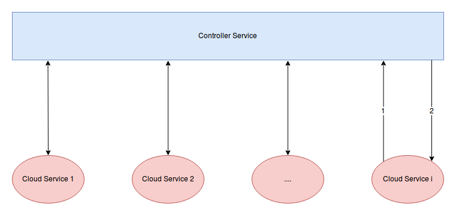

# Kế hoạch xây dựng hệ thống MCOS

Dự kiến hệ thống MCOS sẽ có 2 thành phần: 

- Một service trung tâm làm nhiệm vụ lưu trữ thông tin của tất cả các node trên hệ thống, định kỳ kiểm tra trạng thái của các node và điều phối các hoạt động chung giữa các node, đặt tên là Controller Service.

- Tương ứng với N Cloud Service cần quản lý sẽ có N Cloud Service. Mỗi một Cloud Service sẽ bao gồm 2 thành phần nhỏ:
    - Admin\_Cloud\_Controller làm nhiệm vụ thiết lập các kết nối tới các Cloud Service khác và tạo ra các Ring phân giải tên, đồng thời quản lý danh sách các Object đang có trên Cloud Service này.
    - User\_Dashboard có nhiệm vụ phục vụ End User.

Qúa trình thiết lập hệ thống được thực hiện theo các bước sau:

1. Khởi động Controller Service
1. Lần lượt khởi động các Cloud Service thành viên. Mỗi một **Cloud Service i** khi khởi động sẽ kết nối với Controller Service để yêu cầu Controller Service cho phép Cloud Service i join vào hệ thống, Cloud Service i sẽ cần phải gửi lên cho Controller Service các thông số của nó: Địa chỉ, vị trí, các thông số hiệu năng: tốc độ đọc/ghi, dung lượng,....
1. Khi Controller Service nhận được request từ Cloud Service i, nó sẽ thêm Cloud Service i gửi request vào danh sách Cloud Service đang có mặt trên hệ thống, sau đó gửi response accept tới Cloud Service gửi request, đồng thời Controller Service cũng gửi một message tới tất cả các Cloud Service thông báo **danh sách Cloud Service** mới của hệ thống sau khi Cloud Service i.
1. Giả sử hệ thống có tất cả **n** Cloud Service đánh thứ tự là 0,1,... n-1 , thì sau khi Cloud Service n-1 gia nhập hệ thống, có 2 cách thiết kế:
    - Controller Service sau khi đã thấy đủ **n** Cloud Service sẽ tự động gửi request yêu cầu các Cloud Service trên hệ thống bắt đầu quá trình khởi tạo các Ring.
    - Người Admin sau khi đăng nhập vào controller_dashboard  sẽ kích hoạt quá trình yêu cầu các Cloud Service tạo ring.

Sau khi các ring cần thiết để phân giải tên được tạo ra, hệ thống bắt đầu phục vụ end_user.

Note: Mỗi phần tử j trong **danh sách Cloud Service** của hệ thống đại diện cho Cloud Service j trên hệ thống và nó chứa tất cả các thông tin liên quan tới các thông số của Cloud Service j đó.

Ý tưởng điều chỉnh:

- Có thể đẩy một số công việc của phần Admin\_Cloud\_Controller ở các Cloud Service lên cho Controller Service. Admin\_Cloud\_Controller sẽ chỉ làm việc tạo các Ring phân giải tên và quản lý danh sách các Object đang có trên Cloud Service.