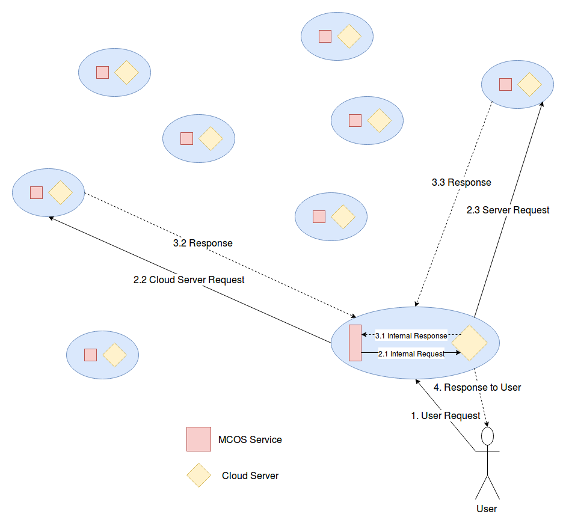

# Represent MCOS Problem in Mathematical Model

Trong bài viết trước, chúng ta đã đề xuất mô hình thực tế cho bài toán MCOS. Hệ thống MCOS  khi triển khai trên thực tế sẽ có mô hình như sau:

Trong bài viết này, chúng ta sẽ tiếp tục bổ sung về mô hình tương tác của hệ thống MCOS. Sau đó, chúng ta sẽ tiến hành xây dựng mô hình toán học cho hệ thống MCOS thông qua các công việc sau:

- Ánh xạ các đối tượng trong hệ thống thành các biến và tham số.
- Xác định giá trị các đối tượng và thuộc tính.
- Xác định các công thức liên kết các đối tượng và các thuộc tính với nhau.

## Problem review

Vấn đề cơ bản mà chúng ta cần giải quyết trong hệ thống MCOS vẫn là:

Khi User gửi một request lên Storage System gần với User đó nhất trong số các Storage System của hệ thống, với yêu cầu là lưu trữ Data Object **x** lên hệ thống MCOS với số bản sao là **k**, thì hệ thống sẽ phải xác địnhh được **k** Storage System nào sẽ lưu trữ **k** bản sao của **x**. Ở đây có 2 phương pháp tiếp cận: 

- Cho người dùng chọn 1 trong số các kịch bản
- Hệ thống tự động thực hiện việc tính toán và lựa chọn k Storage System thỏa mãn một tập điều kiện nào đó.

Trong trường hợp chúng ta cho phép người dùng chọn kịch bản, thì sau khi System nhận request có được các thông tin:

- Lựa chọn người dùng đã chọn
- Trạng thái của tất cả các System trên hệ thống

Thì System nhận request sẽ tiến hành tính toán để xác định k Server sẽ lưu trữ k bản sao của Data Object mà người dùng muốn lưu trữ

Vấn đề đặt ra ở đây: 

- Làm sao chúng ta có thể lưu trữ được thông tin định tuyến: Các bản sao của một Data Object nằm trên các Storage System nào ? (Trong MCS chúng ta sử dụng bảng băm để lưu trữ thông tin định tuyến này.)

## Mô hình tương tác của hệ thống MCS

Như hình vẽ phía trên, chúng ta có thể thấy rằng, về mặt mô hình thì hệ thống MCOS là một tập hợp các đối tượng Storage System nằm phân tán ở nhiều vị trí. Bên trong mỗi một Storage System bao gồm 2 thành phần chính sau:
 
- Một (hoặc nhiều) MCOS Services, có vai trò kết nối và trao đổi thông tin giữa các Cloud System với nhau và kết nối với Cloud Server nằm bên trong Storage System đó.
- Một Cloud Server, có vai trò là nơi lưu trữ thông tin - Data Object do người dùng đẩy lên hệ thống.

( Một MCOS Service là một tập hợp các process bao gồm WSGI Server, Message Queue, Databases...).

Với mô hình này, thì về cơ bản quá trình tương tác giữa các thành phân trong hệ thống khi phục vụ một request người dùng gửi lên như sau:

1. User gửi request lên Storage System gần với User đó nhất. MCOS Service sẽ thực hiện việc xử lý request.
1. MCOS Service sẽ thực hiện việc tìm kiếm (lookup) cac đối tượng liên quan tới request trên hệ thống, sau đó thực hiện việc gửi các request tới các đối tượng này cũng như tới Cloud Server mà nó quản lý (nếu cần thiết).
1. Sau khi request được xử lý, Storage System gửi trả kết quả xử lý request về cho người dùng.

Với quá trình xử lý này, chúng ta có thể thấy rằng, trong MCOS Problem, thì yếu tố khoảng cách giữa 2 đối tượng trong hệ thống là khoảng cách giữa 2 Storage System, chứ không phải là khoảng cách từ User - Client tới các Storage System. Việc này rất quan trọng vì trên thực tế thì chúng ta không thể xác định chính xác được sẽ có bao nhiêu Client sử dụng hệ thống, và vị trí của từng Client cũng không phải là cố định và được biết trước. Chính vì vậy, chúng ta sẽ sử dụng Storage System nhận Client Request để "đại diện" cho Client. Khoảng cách giữa Các Storage System là cố định, và số lượng Storage System trong hệ thống có tính ổn định, và không thường xuyên xảy ra sự thay đổi.

## Xây dựng mô hình toán học cho hệ thống MCOS

MCOS Problem được phát biểu như sau:

Cho một tập hợp **n** Storage System _ss\_1, ss\_2, ..., ss\_n_. Mỗi một Storage System _ss\_i_ trong tập hợp trên có các thuộc tính sau:

- Độ trễ từ _ss\_i_ tới các Storage System khác trong mạng: **latency_arr[n]**, với **latency[j] = calculate_latency(ss\_i,ss\_j)**
- Số lượng request có thể xử lý trong một đơn vị thời gian.
- Loại hình lưu trữ (SSD/HDD)
- Dung lượng / dung lượng còn trống.
- Lượng request trung bình phục vụ
- Băng thông đường truyền tối đa/ băng thông đường truyền còn lại
- Chi phí duy trì Cloud Server ($/GB/Hour)
- Trạng thái của Cloud Server: Active/Deactive (Thầy Minh bổ sung)

Trong đó một số thuộc tính có ảnh hưởng tới nhau: 

- Lượng request trung bình phục vụ và băng thông đường truyền tối đa được sử dụng để ước lượng băng thông đường truyền còn lại.

problem:

## Giải pháp đề xuất 1: Sử dụng hệ trợ giúp quyết định

- Các thuộc tính bên trên đã đúng và đủ chưa (có thuộc tính nào không cần thiết hay không, hay có thiếu thuộc tính nào hay không ?)
- Cần xác định công thức tính độ hiệu quả của phương pháp chọn Cloud Server (khi đã xác định được K Cloud Server thì giá trị của K Cloud này là bao nhiêu ?) ? Vì công thức này cần có sự logic và có lập luận, chứ không thể tự lập ra từ quan điểm cá nhân mà không có lập luận.
- Nếu đi theo hướng hệ trợ giúp quyết định: Liệt kê **M** phương án, tính điểm cho từng phương án trong **M** phương án trên. Chọn ra phương án có điểm cao nhất.

## Giải pháp đề xuất 2

Để đáp ứng 1 lựa chọn **t** của người dùng, xác định tập n\_1 các Storage System là tập con của tập **n** Storage System thỏa mãn lựa chọn **t**

Hệ thống sẽ đưa ra **p** lựa chọn: _p\_1, p\_2, ..., p\_n_. mỗi lựa chọn p\_i là một tập các tiêu chí, ví dụ lựa chọn p\_3:

- Gần Cloud Server gửi request nhất.
- Có chi phí lưu trữ nhỏ nhất.
- Độ trễ trung bình.
- Hệ số nhân bản k = 5

Tương ứng với mỗi lựa chọn **p\_j**, chúng ta lấy được một tập **t\_j** các Storage System phù hợp nhất với các tiêu chí trong yêu cầu **p\_i** này.

Công thức tính độ phù hợp giữa Storage System **i** với lựa chọn **t\_j**: _fit(SS\_i,p\_j)_

Công thức tính độ phù hợp giữa tập Storage System  **t\_k** với lựa chọn **p\_j**: _cloud\_set\_fit(t\_i,p\_j)_

Phương pháp tính toán giá trị từ 2 công thức trên:

- Dựa vào các thuộc tính của một Storage System như đã liệt kê ở phía trên
- Dựa vào các thuộc tính của một lựa chọn
- Dựa vào các thuộc tính của một tập Storage System (đặt tên là Storage\_System\_Set) (ví dụ như độ trễ trung bình giữa các Storage System trong tập...)

Yêu cầu của thầy:

Xây dựng công thức tổng quát dưới dạng mô hình toán học cho 2 công thức trên. Để tổng quát thì chúng ta sẽ đặt A(a1,a2,....,an) là tập **n** thuộc tính của Cloud Server, B(b1,b2,....,bm) là tập **m** thuộc tính của một tiêu chí, C(c1,c2,...,cp) là tập **p** thuộc tính của một Storage\_System\_Set

Phần triển khai: Chọn từ 3-5 thuộc tính cho một tiêu chí, 3-5 thuộc tính cho một Storage System để thử nghiệm.

**note:** các lựa chọn được coi là độc lập và không có ảnh hưởng/ tác động đến nhau.