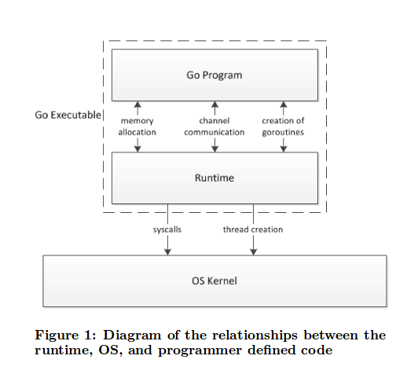

# Phân tích và thảo luận về mô hình Concurrency programming trong Go Lang Programming Language

Trong quá trình tìm giải pháp để giải quyết bài toán xử lý xung đột tài nguyên trong vấn đề concurrency của MCS, anh Hiếu có đưa ra một use case về concurrency là mô hình của Go Lang. Bài viết này sẽ tập trung vào phân tích và thảo luận về use case này, để qua đó chúng ta có thể hiểu được Go Lang đã giải quyết bài toán concurrency như thế nào.

Go là một ngôn ngữ ra đời năm 2007, được phát triển bởi Google và cộng đồng mã nguồn mở. Là sự kế thừa phát triển từ các ngôn ngữ lập trình trước đây, Go có rất nhiều ưu điểm như:

- Chương trình Go được biên dịch ra mã máy nhưng trong Go có thành phần Garbage Collector, nên Go duy trì được đồng thời hai đặc điểm là tốc độ cao và dễ quản lý và tổ chức mã nguồn chương trình
- Cấu trúc chương trình Go đơn giản, mã nguồn viết bằng Go thường ngắn gọn và dễ hiểu
- Go hỗ trợ rất tốt cho các chương trình đa luồng/ đa triến trình - concurrent programs. Go hỗ trợ concurrency từ mức language layer.
- ...

Trong các ưu điểm trên, ưu điểm nổi bật nhất của Go là hỗ trợ concurrency từ mức language layer. Khả năng concurrency của Go rất lớn, chúng ta có thể tạo ra hàng nghìn luồng chương trình thực thi đồng thời với nhau trong một Go process. Để làm được điều này, Go lang đã xây dựng một số nền tảng hỗ trợ concurrency programming model: Go routine, context và scheduler. Với mực tiêu của bài viết của chúng ta là tìm hiểu về cơ chế concurrency trong Go lang, việc hiểu rõ về các nền tảng này và cách thức các nền tảng này phối hợp với nhau để thực thi đồng thời các tiến trình là một điều rất quan trọng trong bài viết, tuy nhiên trước khi tìm hiểu chúng là gì và vai trò của chúng trong concurrency mechanism của Go lang ra sao, thì trước hết, việc đầu tiên chúng cần phải làm, là hiểu xem một Go lang process hoạt động như thế nào. Để làm được điều này, chúng ta sẽ tìm hiểu về thành phần điều khiển quá trình hoạt động của một Go lang process - **Go Runtime**

## 1. Go Runtime

Trong một process của một program được viết bằng Go lang, thì Go runtime là thành phần đóng vai trò quản lý luồng hoạt động của program đó, cũng như quản lý các thành phần khác trong process như scheduler, garbage collection và các goroutine. Vì vậy, mọi hoạt động trong một process viết bằng Go đều nằm dưới sự quản lý của Go runtime, và Go run time thực hiện việc quản lý Goprocess bằng cách đóng vai trò như một layer trung gian nằm giữa hệ điều hành và và thành phần mã nguồn thực của chương trình do lập trình viên viết ra.

Go runtime được viết bằng C, asembly và bằng chính Go (tương tự như trường hợp PyPy :) ) và được biên dịch ra dưới dạng một package. Go runtime package được tự động import và linking vào tất cả các chương trình viết bằng Go lang tại thời điểm các chương trình đó được biên dịch. Chính vì cơ chế import và linking tự động này, nên dù ở bên ngoài chúng ta sẽ một chương trình go lang có thể được biên dịch ra dưới dạng một file thực thi chứa mã máy duy nhất, nhưng trong thực tế khi chương trình Go lang đó được chạy thành một process, thì trong một Go lang process sẽ có 2 layer: runtime layer và user program layer. Trước khi các câu lệnh nằm trong user program layer của Go lang process được thực thi, chúng sẽ đi qua runtime layer để runtime layer thực hiện các quá trình quản lý như lscheduling và garbage collection - Any calls the user code makes to the operating system’s APIs are intercepted by the runtime layer to facilitate scheduling, as well as garbage collection [2]



Qua phân tích vừa rồi, chúng ta đã hiểu được vị trí và chức năng của Go runtime trong một process của một chương trình viết bằng Go lang. Tiếp theo, chúng ta sẽ xem Go runtime và các thành phần goroutine, context và scheduler sẽ phối hợp với nhau như thế nào khi một concurrent program viết bằng Go được thực thi. Nhưng trước hết, chúng ta sẽ nhắc lại một số khái niệm liên quan tới concurrent programming như: Process, thread, multi-threading program.

## Multi-threading process

Concurrent programming được hiểu là các phương pháp thiết kế và xây dựng nên một concurrent program, hay một chương trình có khả năng thực hiện nhiều công việc trong một đơn vị thời gian - delta. Multi-threading là một trong các phương pháp trong  Concurrent programming, trong đó chương trình của người dùng tạo ra khả năng thực hiện đồng thời nhiều công việc bằng Multi-threading process.

Process - tiến trình, là đơn vị công việc được tạo ra bởi hệ điều hành (operating system). Theo một góc nhìn chung, process có thể coi là trạng thái thứ hai của một chương trình, khi chương trình đó được nạp vào bộ nhớ trong và được CPU của máy tính thực thi (trạng thái thứ nhất của chương trình chính là file/folder chứa mã nguồn của chương trình đó nằm trên bộ nhớ ngoài của máy tính).

Để các câu lệnh của chương trình được nạp vào process được CPU của máy tính thực thi, thì các câu lệnh đó phải được đưa vào thread, một trong các thành phần chính của process. Thread được định nghĩa là một luồng thực thi - stream of executable code của một Linux proces mà được lập lịch độc lập bởi scheduler - thành phần phân phối proccessor của hệ điều hành.

Một process có ít nhất một thread, process có nhiều thread được gọi là multi-threading process. Trong một multi-threading process, nhiều luồng thực thi - thread được CPU của hệ thống đồng thời thực hiện độc lập trong cùng một khoảng thời gian.


Trong multi-theading process, sẽ có một process đóng vai trò primary thread, thread này sẽ thực thi luồng điều khiển chính của process, các thread còn lại gọi là sub-thread. Mỗi một thread chứa một luồng điều khiển (khối mã nguồn được lập trình viên viết để thực thi trên thread) riêng, và một sub-thread sẽ được sinh ra ở một thời điểm xác định từ primary thread của process quản lý nó. Sau khi thread được process sinh ra, luồng điều khiển của thread đó sẽ được thực thi độc lập và đồng thời (concurrency) với các thread còn lại trong process và với các thread của các process khác.


Thông qua các khái niệm ở trên, chúng ta đã hiểu rằng một multi-threading process là gì. Lý do chúng ta cần tìm hiểu về  multi-threading process trước khi đi vào phân tích mô hình concurrency của Go lang, vì về bản chất, khi một Go lang concurrency program được thực thi, program đó sẽ chính là một multi-threading program, trong đó Go runtime sẽ nằm ở primary thread. Tuy nhiên, một sự khác biệt giữa mô hình concurrency của Go lang với mô hinh multi-threading program truyền thống, đó là đơn vị luồng thực thi độc lập của Go lang không phải là thread, mà là các goroutine. Phần tiếp theo của bài viết sẽ giải thích lý do goroutine lại được sử dụng để tạo ra Go lang concurrency model, và sự kết hợp của goroutine, Scheduler với Multi-thread trong concurrency model này.

## Go lang concurrency model

Mặc dù Multi-threading programming đã cho phép chúng ta tạo ra một chương trình có khả năng concurrency, tuy nhiên mô hình multi-threading có một số hạn chế rất lớn:

- Chi phí tài nguyên để tạo ra và duy trì OS Thread là lớn, tuy chi phí này có nhỏ hơn chi phí tạo ra một process, tuy nhiên nó vẫn không đủ nhỏ để chúng ta có thể tạo ra một số lượng lớn các luồng thực thi độc lập. Ví dụ, như một máy tính có cấu hình trung bình 4 cores, 4 GB chỉ có thể tạo ra tối đa vài nghìn threads, trong khi đó với Go lang, chúng ta có thể tạo ra tới hàng chục nghìn, thậm chí hàng trăm nghìn luồng thực thi độc lập.
- Lập trình viên không thể điều khiển được việc lập lịch và thực thi các OS thread, việc lập lịch và thực thi các OS thread là do scheduler của hệ điều hành quyết định và lập trình viên không thể can thiệp vào quyết định lập lịch của OS scheduler, điều này dẫn tới việc một số Thread trong chương trình dù không thực thi câu lệnh (ví dụ như khi đang chờ đợi một I/O event) nhưng vẫn chiếm giữ quyền sử dụng CPU, làm giảm hiệu năng của hệ thống. Và chi phí để thực hiện thao tác context switching khi CPU chuyển từ thực thi thread này sang thực thi một thread khác cũng ảnh hưởng lớn tới khả năng concurrency của chương trình.

Chính vì các hạn chế này, mà bây giờ các chương trình thiết kế theo mô hình multi-threading đã không còn đáp ứng được các yêu cầu về hiệu năng đặt ra cho các concurrency program. Điều này đã dẫn tới việc các nhà phát triển của Go lang đã xây dựng một concurrency model mới - Golang concurrency model.

Golang concurrency model là mô hình concurrency hoạt động xung quanh 3 loại đối tượng chính: Goroutine, Thread, Context Scheduling, trong đó:

- Goroutine là đơn vị luồng thực thi độc lập trong Go lang. Tương tự như thread, một goroutine cũng có các thành phần như stack, instruction pointer và các thông tin liên quan phục vụ cho việc thực thi các câu lệnh trong goroutine đó, và một gorountine cũng có thể bị block luồng thực thi và contiune execution trong khi goroutine đó được chạy trong Process. Tuy nhiên, điểm khác biệt giữa goroutine và OS Thread, đó là OS Thread được OS Scheduler lập lịch thực thi, còn goroutine được lập lịch bởi Go Scheduler. Vì vậy, goroutine còn được gọi là user-space thread. Goroutine trong các hình vẽ của bài viết này sẽ được ký hiệu là G.
- Thread mà Go lang Process sử dụng chính là OS Thread mà chúng ta vừa đề cập phía trên, được ký hiệu là M.
- Context Scheduling chính là thành phần con của Go Scheduler, Context Scheduling điều khiển việc lập lịch cho một OS Thread thực thi các goroutine. Context Scheduling được ký hiệu là P.

Để tạo ra môi trường concurrency, Go lang process sẽ tạo ra các thành phần phục vụ cho Concurrency như Golbal Run Queue, Thread Cache, Scheduler cũng như các thành phần khác trong Go lang như Garbage Collector,... Sau đó, Go Scheduler sẽ tạo ra các Context Scheduling, với số lượng Context Sheduling được tạo ra thường bằng giá trị GOMAXPROCS(). Tiếp đó, Go lang process sẽ tạo ra các OS Thread, Đưa các goroutine vào Context Scheduling rồi gán Context Scheduling cho một OS Thread. Context Scheduling sẽ chỉ định cho OS Thread thực thi goroutine nào trong các goroutine mà Context Scheduling đó quản lý. Quá trình thực thi các goroutine bắt đầu.


Hình vẽ trên đây mô tả hệ thống khi các goroutine được các OS Thread thực thi. Như chúng ta thấy trên hình vẽ, sau khi được Process gán cho Context Scheduling, các OS Thread bắt đầu thực thi goroutine mà Context Scheduling chỉ định. Tại một thời điểm bất kỳ trong quá trình Go lang Process hoạt động, một OS Thread sẽ chỉ thực thi một **active goroutine** - Là goroutine có màu xanh trên hình vẽ. Các goroutine màu xám là các **waitting goroutine** đang chờ được thực thi, chúng nằm trong các local runqueue. Mỗi một Context Scheduling sẽ có một local runqueue riêng. Ở các phiên bản trước của Go, tất cả các Context Scheduling dùng chung một global runqueue, vì vậy để điều phối các goroutine từ global runqueue này cho các Context Scheduling, chúng ta phải sử dụng các kỹ thuật điều phối tài nguyên như mutex, nhưng các kỹ thuật này làm ảnh hưởng tới hiệu năng xử lý của hệ thống. Chính vì vậy, trong phiên bản hiện tại mỗi một Context Scheduling có một local runqueue riêng.

Một active goroutine sẽ được OS Thread thực thi cho đến hết, hoặc khi việc thực thi goroutine đó chạm tới thời điểm scheduling point. Khi một trong 2 điều kiện này xảy ra, active-goroutine sẽ được đưa ra khỏi Context Scheduling, sau đó:

- Nếu goroutine này đã thực hiện xong, tiến hành hủy bỏ goroutine này.
- Nếu goroutine này chưa thực hiện xong nhưng đang thực hiện một số thao tác làm block thread hiện tại, Context Scheduling này sẽ tách goroutine này ra và gắn go routine này trực tiếp vào Thread hiện tại, sau đó Context Sheduling rời khỏi Thread hiện tại đang bị block, sau đó nó được Go Scheduler gắn vào 1 Thread khác.
- Trong các trường hợp còn lại khi quá trình thực hiện active-goroutine bị block lại nhưng không làm thread bị block (ví dụ như do Network I/O hoặc Disk I/O ...), nó sẽ được tách ra khỏi Context Scheduling và đặt lên một queue khác.

Sau khi active-goroutine được tách ra khỏi Context Scheduling, local runqueue của Context Scheduling đó sẽ đẩy ra goroutine trên cùng của queue, sau đó goroutine này sẽ được gắn vào và trở thành active-goroutine mới của Context-Scheduling này, và được OS Thread chứa Context-Scheduling này thực thi. Trong trường hợp không còn goroutine nào trong Context Scheduling nữa, Go Scheduler sẽ đẩy các goroutine đang có trong global queue vào local queue của Context Scheduling này, hoặc thực hiện thao tác **Stealing Work**, hoặc OS Thread sẽ giải phóng Context Scheduling, trở về Thread Cache và sleep. (\*)

Trong quá trình thực thi chương trình, khi một thread nào đó trong Go lang process thực thi một câu lệnh ```go```, một goroutine mới sẽ được tạo ra và được xếp vào đuôi local runqueue của một trong số các Contex Scheduling.[4]

Qua phân tích trên, chúng ta đã hiểu được về cơ bản, mô hình Concurrency Model của Go lang hoạt động như thế nào. Tuy nhiên, trong mô hình trên, chúng ta sẽ thấy có một vấn đề vẫn chưa được phân tích chi tiết. Đó là, trong điều kiện nào thì sẽ xảy ra trường hợp goroutine thực hiện một số thao tác làm block Thread, và tại sao trong trường hợp này chúng ta lại cần chuyển Context Scheduling sang một Thread khác khi goroutine block Thread ? Đó là do khi một Thread bị block, nó sẽ không thể thực hiện các goroutine khác trong local queue nữa.

## Block thread Goroutine

Trong một số trường hợp, việc thực thi một goroutine có thể làm Block Thread thực thi goroutine đó, ví dụ như khi Thread đó thực thi một lời gọi hệ thống - system call.


Như đã trình bày ở phần trên, khi trường hợp này xảy ra, Chúng ta sẽ tách goroutine đang làm block Thread ra, sau đó Go Scheduler tách Context Sheduling khỏi block Thread rồi lấy ra một Thread trong Thread Cache và gắn Context Sheduling vào Thread đó. Nếu như không còn Thread nào trong Thread Cache, một Thread mới sẽ được tạo ra, do vậy trên hình vẽ minh họa, Thread M1 có thể là một thread lấy ra từ Thread Cache, và cũng có thể là thread mới được tạo ra. Sau khi chúng ta đã gắn Context Sheduling vào Thread mới, Thread mới sẽ tiếp tục thực hiện quá trình (\*).

Quay trở lại với Thread M0, sau khi M0 thực hiện xong systemcall của routine G0, M0 sẽ thử tìm xem có Context Scheduling nào tách rời, chưa được gắn với Thread không. Nếu không có Context Scheduling nào phù hợp, nó sẽ đặt goroutine G0 vào một queue gọi là global run queue, sau đó MO sẽ chuyển sang trạng thái sleep và được đặt vào Thread cache. Sau đó, các Context Scheduling trong process sẽ lấy ra các goroutine trong global runqueue và push vào local runqueue của nó.

Chính vì cơ chế xử lý systemcal như trên, nên khi một Go lang process đang thực thi, chúng ta sẽ thấy số lượng OS Thread có trong process đó có thể lớn hơn số lượng Context Scheduling. Nguyên nhân là do một số OS Thread sẽ không chứa Context Scheduling mà thực hiện các System Call.

## Stealing work

Trong khi một Concurrent Go process đang thực thi, có thể xảy ra một trường hợp là không còn goroutine nào trong localqueue của Context Scheduling này và trong global queue cũng không còn goroutine nào nữa, trong khi số lượng goroutinte trong localqueue của một Context Scheduling khác vẫn còn lớn. Lúc này, như đã nói ở phần trên, để cân bằng số lượng goroutine trong các localqueue, Go Scheduler sẽ thực hiện thao tác **Stealing Work** [3]


Trên đây là các phân tích về mô hình concurrency Model của Go lang, mô hình kết hợp giữa multi-threading và user-threading đã cho phép các Go process có thể xử lý được một số lượng lớn các luồng thực thi đồng thời với nhau, qua đó cho phép các Go process có được khả năng concurrency rất tốt.

## Tài liệu tham khảo

[1] [https://github.com/HPCC-Cloud-Computing/hpcc-know-how/blob/master/OpenStack/Computing-Nova/Nova-Architect/Threading_model.md](https://github.com/HPCC-Cloud-Computing/hpcc-know-how/blob/master/OpenStack/Computing-Nova/Nova-Architect/Threading_model.md)

[2] Analysis of the Go runtime scheduler - Neil Deshpande, Erica Sponsler, Nathaniel Weiss - Columbia University. [http://www.cs.columbia.edu/%7Eaho/cs6998/reports/12-12-11_DeshpandeSponslerWeiss_GO.pdf](http://www.cs.columbia.edu/%7Eaho/cs6998/reports/12-12-11_DeshpandeSponslerWeiss_GO.pdf)

[3] [https://morsmachine.dk/go-scheduler](https://morsmachine.dk/go-scheduler)

[4] <https://www.quora.com/How-does-the-golang-scheduler-work>