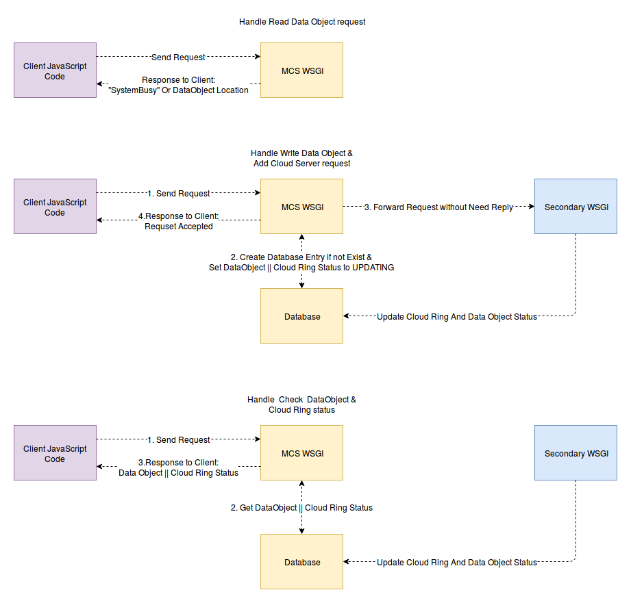

# Thiết kế hệ thống - System Design Discussion

Hôm trước anh Hiếu yêu cầu em nghĩ ra cách để xử lý vấn đề quản lý việc nhiều thread cùng truy cập chung vào Ring. Em có đề xuất và trao đổi với anh Hiếu một số ý kiến, thì theo anh Hiếu, yêu cầu đặt ra đối với hệ thống MCS WSGI là làm sao để hệ thống phản hồi cho request của người dùng nhanh nhất có thể. Hôm trước em có suy nghĩ về cái yêu cầu này, thì theo ý kiến cá nhân em, việc đáp ứng được yêu cầu (1) rất có thể dẫn tới hai trường hợp: hoặc phải thiết kế lại hệ thống, hoặc là hệ thống chỉ đáp ứng được một phần yêu cầu. Do vậy em nghĩ là em sẽ viết thử các ý tưởng của em để thiết kế hệ thống thỏa mãn yêu cầu nói trên của anh Hiếu.

## 1. Các chức năng chính để làm tiền đề thiết kế hệ thống

Để nội dung bài viết ngắn gọn, em đưa ra 3 chức năng chính sau làm tiền đề để thiết kế MCS:

- Chức năng đọc DataObject
- Chức năng tạo mới DataObject
- Chức năng thêm CloudServer

3 chức năng trên dẫn tới việc mỗi một chức năng sẽ tương ứng với một loại request mà hệ thống cần xử lý:

Read_DataObject request
Create_DataObject request
Add_CloudServer request

## 2. Phương thức xử lý hiện tại

Theo góc nhìn hiện tại, thì tất cả các thread trong MCS WSGI xử lý 3 request tương ứng 3 chức năng trên trên đều sử dụng tới tài nguyên chia sẻ chung giữa các thread trong WSGI Process là CloudRing.  Hiện tại thì các bước xử lý từng loại request của người dùng như sau:

- Read DataObject request: Quá trình xử lý Read DataObject request bao gồm các bước:
    - Read CloudRing để tìm ra Các CloudServer chứa replica của DataObject cần đọc
    - Gửi request kiểm tra xem các replica của Data Object này có tồn tại trên các CloudServer hay không ?
    - Nếu replica của Data Object này có tồn tại trên các CloudServer, tiến hành lấy thông tin truy cập của các CloudServer đó
    - Gửi trả về cho Client thông tin truy cập các CloudServer.

- Write DataObject request: Quá trình xử lý Write DataObject request bao gồm các bước:
    - Read CloudRing để tìm ra Các CloudServer chứa replica của DataObject cần đọc
    - Gửi request kiểm tra xem các replica của Data Object này có tồn tại trên các CloudServer hay không ?
    - Nếu replica của Data Object này không tồn tại trên tẩ cả các CloudServer, tiến hành lấy thông tin truy cập của các CloudServer đó, rồi chọn một CloudServer trong số các cloudserver, rồi tạo replica trên Clouserver được chọn, với đầu vào là nội dung file mà người dùng gửi kèm request.
    - Giao phần việc còn lại lên message queue
    - Gửi phản hồi về cho người dùng thông báo DataObject đang được xử lý

- Add CloudServer request: Quá trình xử lý Add CloudServer request bao gồm các bước:
    - Ghi Ring mới vào WSGI Process
    - Ghi Ring mới vào file
    - Gửi request tới các thành phần khác trong hệ thống yêu cầu thay đổi Ring thành Ring mới
    - Giao phần việc còn lại lên message queue. Phần việc còn lại bao gồm việc di chuyển các Replica nằm không đùng vị trí trong ring mới
    - Gửi phản hồi về cho người dùng thông báo Quá trình thêm Cloud Server mới đang được tiếp tục xử lý

Sau khi xác định những bước xử lý chính cho từng loại request, em sẽ xây dựng thêm cơ chế xử lý xung đột về truy cập tài nguyên chung.

## 3. Cài đặt cơ chế xử lý xung đột truy cập tài nguyên chung vào các phương thức xử lý hiện tại

Đầu tiên, em sẽ xây dựng cơ chế truy cập tài nguyên chung chưa xét tới khoảng thời gian mà các thread phải chờ trước khi được truy cập vào Data Object. Ở đây em sử dụng **read write lock** để xử lý xung đột:

- Read write lock object:

```python
class ReadWriteLock:
    def __init__():

        # write_lock xác định xem tài nguyên chung có đang bị một write_thread nào đó truy cập hay không ?
        self.write_lock = False

        # số lượng read thread đang truy cập vào tài nguyên chung, read_counter = 0 có nghĩa là
        # không có read thread nào đang truy cập vào tài nguyên chúng
        self.read_counter = 0

        # write_semaphore dùng để tạm ngừng luồng thực thi của một write thread
        # cho tới khi một thread khác giải phóng semaphore này.
        self.write_semaphore = Semaphore(0)

        # read_semaphore dùng để tạm ngừng luồng thực thi của một read thread
        # read_semaphore cũng cho biết số lượng các read thread đang chờ được giải phóng read_semaphore
        # cho tới khi một thread khác giải phóng semaphore này.
        self.read_semaphore = Semaphore(0)


# khởi tạo các biến GLOBAL
GLOBAL user_ring
GLOBAL rw_lock = ReadWriteLock()

```

- Read DataObject request:

```python
def process_read_data_object(request):

    # nếu không có write thread nào đang truy cập vào tài nguyên chung,
    # thì chúng ta đi vào truy cập read-only tài nguyên chung và tăng số lượng read_counter lên 1
    if rw_lock.write_lock is False:
        rw_lock.read_counter+=1
    else:   # trong trường hợp đang có write thread truy cập vào tài nguyên chung
            # chúng ta block luồng đọc bằng read_semaphore
        rw_lock.read_semaphore.acquire()

    # Truy cập vào User Ring để lấy vị trí các Cloud Server sẽ chứa các replica của DataObject này
    # Gửi request tới các CloudServer để kiểm tra  sự tồn tại của các Replica
    rw_lock.read_counter -= 1 #thông báo read only request này đã truy cập xong tài nguyên chung

    # trong trường hợp không còn Read Only Client nào
    # truy cập vào tài nguyên chung nữa
    if rw_lock.read_counter == 0:
        # quyết định xem có signaling một write request bằng write semaphore hay không
        if check_write_request_wait_number(rw_lock.write_semaphore) >0:
            # Vì chúng ta quyết định thread tiếp theo thread này là một write thread, nên chúng ta cần phải
            # đặt lại giá trị write_lock để các read-only thread khác không truy cập
            # vào tài nguyên chung trong thời gian chúng ta đang switch tới
            # 1 write thread
            self.write_lock = True
            rw_lock.write_semaphore.release()
    # Gửi thông tin truy cập của các Cloud Server về cho Client
    return CloudServer_info
```

- Write DataObject request:

```python
def process_write_data_object(request):

    # nếu không có write thread nào đang truy cập vào tài nguyên chung,
    # thì chúng ta đi vào truy cập read-only tài nguyên chung và tăng số lượng read_counter lên 1
    if rw_lock.write_lock is False:
        rw_lock.read_counter += 1
    else:   # trong trường hợp đang có write thread truy cập vào tài nguyên chung
            # chúng ta block luồng đọc bằng read_semaphore
        rw_lock.read_semaphore.acquire()

    # Truy cập vào User Ring để lấy vị trí các Cloud Server sẽ chứa các replica của DataObject này
    # Gửi request tới các CloudServer để kiểm tra  sự tồn tại của các Replica
    # Ghi file dữ liệu chứa trong request của người dùng vào một trong các CloudServer

    rw_lock.read_counter -= 1 #thông báo read-only request này đã truy cập xong tài nguyên chung
    # trong trường hợp không còn Read Only Client nào
    # truy cập vào tài nguyên chung nữa
    if rw_lock.read_counter == 0:
        # quyết định xem có signaling một write request bằng write semaphore hay không
        if check_write_request_wait_number(rw_lock.write_semaphore) >0:
            # Vì chúng ta quyết định thread tiếp theo thread này là một write thread, nên chúng ta cần phải
            # đặt lại giá trị write_lock để các read-only thread khác không truy cập
            # vào tài nguyên chung trong thời gian chúng ta đang switch tới
            # 1 write thread
            rw_lock.write_lock = True
            rw_lock.write_semaphore.release()
    # Gửi thông tin truy cập của các Cloud Server về cho Client
    return CloudServer_info,  Message("Write process complete")
```

- Add CloudServer request:

```python
def process_add_cloud_server(request):

    # Thread chạy hàm xử lý request này là một write ring thread
    # chúng ta cần kiểm tra để đảm bảo không có read-only thread và write thread nào đang sử dụng tài nguyên chung
    if rw_lock.read_counter == 0 and  rw_lock.write_lock is False:
        # prevent read-only thread from accessing shared ring
        # when write thread is modifying ring
        rw_lock.write_lock = True
    else:
        # trong trường hợp đang có các read-only thread hoặc write thread truy cập vào tài nguyên chung
        # chúng ta block luồng ghi ring bằng write_semaphore
        rw_lock.write_semaphore.acquire()

    # Truy cập vào Ring, lấy Danh sách vị trí phân bố các CloudServer trên các Node
    # kết hợp danh sách này với CloudServer mới để phân bố lại vị trí của các CloudServer (bao gồm cả CloudServer mới) trên Ring
    # Tạo Ring mới, Ghi Ring mới vào ổ cứng
    # Gửi Ring mới tới các Process khác trong hệ thống
    # Giao phần việc còn lại lên message queue cho một process khác trong hệ thống.
    # Phần việc còn lại bao gồm việc di chuyển các Replica nằm không đúng vị trí trong ring mới


    # quyết định xem có signaling một write request bằng write semaphore hay không
    if check_write_request_wait_number(rw_lock.write_semaphore) >0:
        # Vì chúng ta quyết định thread tiếp theo thread này là một write thread, nên chúng ta cần phải
        # đặt lại giá trị write_lock để các read-only thread khác không truy cập
        # vào tài nguyên chung trong thời gian chúng ta đang switch tới
        # 1 write thread
        self.write_lock = True
        rw_lock.write_semaphore.release()
    else:
        # giải phóng cho tất cả các read-only thread đang chờ read_semaphore
        rw_lock.write_lock = False
        read_only_request_number = check_number(rw_lock.read_semaphore)
        rw_lock.read_counter = read_only_request_number
        for i in range (0, read_only_request_number):
            rw_lock.read_semaphore.release()

    return Message("Cloud Server List is updating")
```

Tuần trước em có đề nghị giải quyết như thế này, tuy nhiên theo anh Hiếu thì cách này tốc độ xử lý yêu cầu của người dùng quá chậm, nên tuần này em đang nghĩ một giải pháp mới để xử lý xung đột. Yêu cầu mới đặt ra cho 3 phương thức xử lý bên trên là:

- Tối thiểu hóa thời gian xử lý một request của người dùng trong mọi trường hợp, với cả 3 loại request, kể cả khi tài nguyên bị khóa lẫn khi tài nguyên không bị khóa.

Dưới đây là một số ý tưởng của em để giải quyết yêu cầu trên.

## 4. Solution \#1: Fast Reply When Block, Client Retry

Giải pháp đầu tiên là khi WSGI process sinh ra một thread để xử lý một trong 3 loại request trên, thì thread đó sẽ kiểm tra xem nó có thể sử dụng tài nguyên chung (ring) hay không. Nếu nó có thể sử dụng, thì nó đi vào tài nguyên chung để xử lý. Nếu không thể sử dụng, thì nó gửi thông bao cho Client tài nguyên không thể chia sẻ được - "resource busy". Khi client nhân được phản hồi từ Server, nếu như phản hồi là "resource busy" thì Client tiến hành gửi lại một request mới, cứ như thế cho đến khi nào Server gửi trả về nội dung mà Client yêu cầu.

```python
class ReadWriteLock:
    def __init__():

        # write_lock xác định xem tài nguyên chung có đang bị một write_thread nào đó truy cập hay không ?
        self.write_lock = False

        # số lượng read thread đang truy cập vào tài nguyên chung, read_counter = 0 có nghĩa là
        # không có read thread nào đang truy cập vào tài nguyên chúng
        self.read_counter = 0

        # write_semaphore dùng để tạm ngừng luồng thực thi của một write thread
        # cho tới khi một thread khác giải phóng semaphore này.
        self.write_semaphore = Semaphore(0)

        # read_semaphore dùng để tạm ngừng luồng thực thi của một read thread
        # read_semaphore cũng cho biết số lượng các read thread đang chờ được giải phóng read_semaphore
        # cho tới khi một thread khác giải phóng semaphore này.
        self.read_semaphore = Semaphore(0)


# khởi tạo các biến GLOBAL
GLOBAL user_ring
GLOBAL rw_lock = ReadWriteLock()

```

- Read DataObject request:

```python
def process_read_data_object(request):

    # nếu không có write thread nào đang truy cập vào tài nguyên chung,
    # thì chúng ta đi vào truy cập read-only tài nguyên chung và tăng số lượng read_counter lên 1
    if rw_lock.write_lock is False:
        rw_lock.read_counter+=1
    else:   # trong trường hợp rw_lock.write_lock is True - tức là đang có write thread truy cập vào tài nguyên chung, trả về server busy
        return "Server Busy"

    # Truy cập vào User Ring để lấy vị trí các Cloud Server sẽ chứa các replica của DataObject này
    # Gửi request tới các CloudServer để kiểm tra  sự tồn tại của các Replica
    rw_lock.read_counter -= 1 #thông báo read only request này đã truy cập xong tài nguyên chung

    # Gửi thông tin truy cập của các Cloud Server về cho Client
    return CloudServer_info
```

- Write DataObject request:

```python
def process_write_data_object(request):

    # nếu không có write thread nào đang truy cập vào tài nguyên chung,
    # thì chúng ta đi vào truy cập read-only tài nguyên chung và tăng số lượng read_counter lên 1
    if rw_lock.write_lock is False:
        rw_lock.read_counter+=1
    else:   # trong trường hợp rw_lock.write_lock is True - tức là đang có write thread truy cập vào tài nguyên chung, trả về server busy
        return "Server Busy"


    # Truy cập vào User Ring để lấy vị trí các Cloud Server sẽ chứa các replica của DataObject này
    # Gửi request tới các CloudServer để kiểm tra  sự tồn tại của các Replica
    # Ghi file dữ liệu chứa trong request của người dùng vào một trong các CloudServer

    rw_lock.read_counter -= 1 #thông báo read-only request này đã truy cập xong tài nguyên chung
    # Gửi thông tin truy cập của các Cloud Server về cho Client
    return CloudServer_info,  Message("Write process complete")
```

- Add CloudServer request:

```python
def process_add_cloud_server(request):

    # Thread chạy hàm xử lý request này là một write ring thread
    # chúng ta cần kiểm tra để đảm bảo không có read-only thread và write thread nào đang sử dụng tài nguyên chung
    if rw_lock.read_counter == 0 and  rw_lock.write_lock is False:
        # prevent read-only thread from accessing shared ring
        # when write thread is modifying ring
        rw_lock.write_lock = True
    else:
        # trong trường hợp đang có các read-only thread hoặc write thread truy cập vào tài nguyên chung
        # chúng ta block luồng ghi ring bằng write_semaphore
        return "Server Busy"

    # Truy cập vào Ring, lấy Danh sách vị trí phân bố các CloudServer trên các Node
    # kết hợp danh sách này với CloudServer mới để phân bố lại vị trí của các CloudServer (bao gồm cả CloudServer mới) trên Ring
    # Tạo Ring mới, Ghi Ring mới vào ổ cứng
    # Gửi Ring mới tới các Process khác trong hệ thống
    # Giao phần việc còn lại lên message queue cho một process khác trong hệ thống.
    # Phần việc còn lại bao gồm việc di chuyển các Replica nằm không đúng vị trí trong ring mới

    # giải phóng khóa write lock
    rw_lock.write_lock = False
    return Message("Cloud Server List is updating")
```

Điểm mạnh của giải pháp này là thời gian xử lý request rất nhanh
Cách này có một điểm yếu là người dùng phải gửi lại request nếu Server trả về response là **"Server Busy"**. Trong trường hợp người dùng sử dụng chức năng create DataObject thì mỗi lần gửi lại request thì người dùng lại phải gửi lại File, nếu File có kích thước lớn thì chuối.

## 5. Solution \#2: Fast Reply When Block, Process Read-Only Thread, Forward Write Request to another Process

Giải pháp thứ hai là mở rộng của giải pháp thứ nhất. Ở giải pháp thứ 2 em sử dụng thêm một WSGI thứ hai - Secondary WSGI để xử lý Write DataObject request và Add CloudServer request. Khi MCS WSGI nhận được 2 loại request này thì nó forward chúng cho Secondary WSGI rồi phản hồi cho người dùng hệ thống đã nhận được yêu cầu, yêu cầu đang được xử lý. Read request vẫn được MCS WSGI xử lý như Solution #1




Ưu điểm của giải pháp này: Đảm bào xử lý nhanh request của người dùng mà không cần cơ chế retry - gửi lại như solution 1 - Trừ Read Request. Read Request cho phép dùng Retry vì Request này không cần gửi kèm dữ liệu, và thứ 2 là request này không làm thay đổi bất cứ dữ liệu nào trong hệ thống.

Các vấn đề với giải pháp này:

- Phải có thằng Database trung gian để trao đổi và cập nhật kết quả Giữa các thành phần
- Phải có cơ chế lock phân tán - Distributed Mutual Exclusion giữa nhiều tiến trình, vì cái MCS với cái Secondary có chung cái Ring - Cũng chính vì thế nên dù tách chức năng ra rồi nhưng vẫn MCS vẫn có thể trả về Server Busy. Cái này thì sau này em mở rộng thì kiểu gì vẫn phải làm, nhưng nếu làm luôn bây giờ thì em lại phải ngồi đọc xem Swift với Nova nó lock giữa nhiều tiến trình như thế nào.
- Sử dụng cách này thì em sẽ phải thiết kế lại hệ thống, thêm thằng Secondary WSGI với cái cụm Database vào.