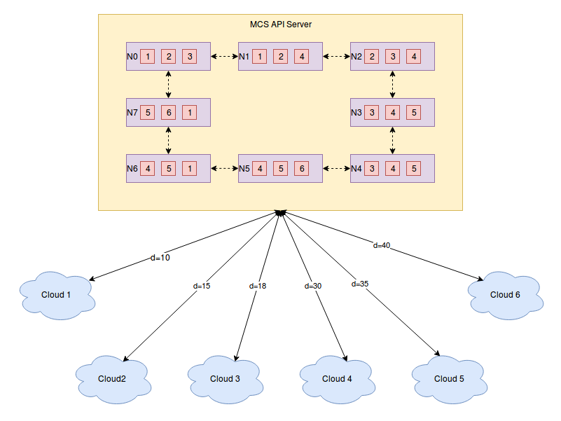
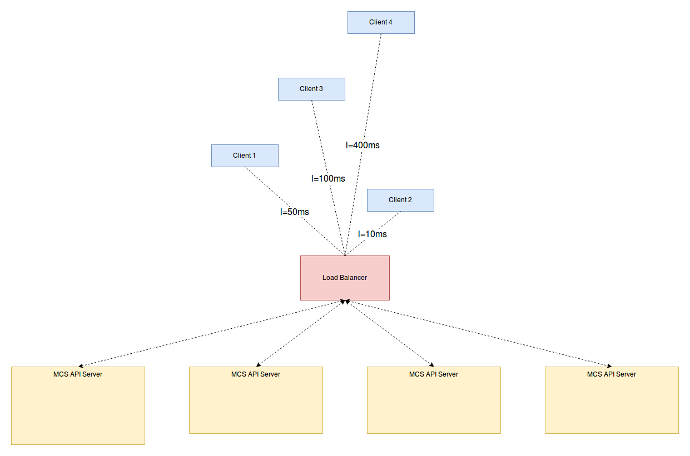
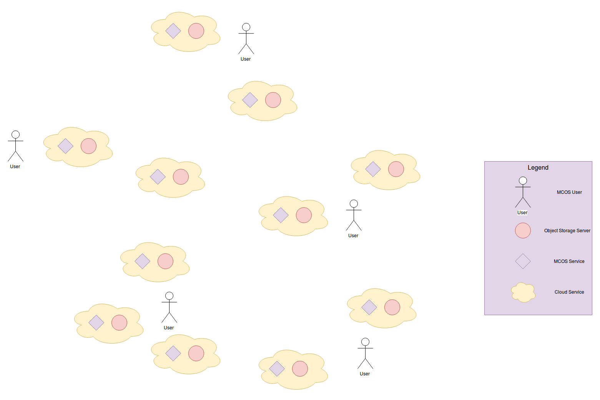
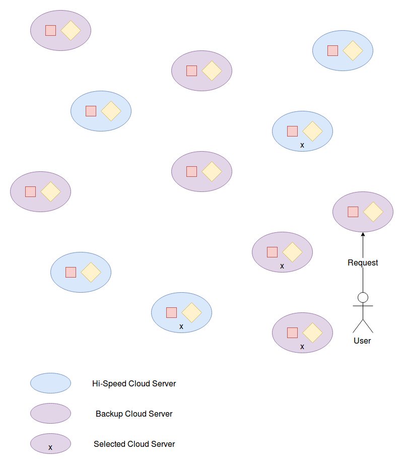
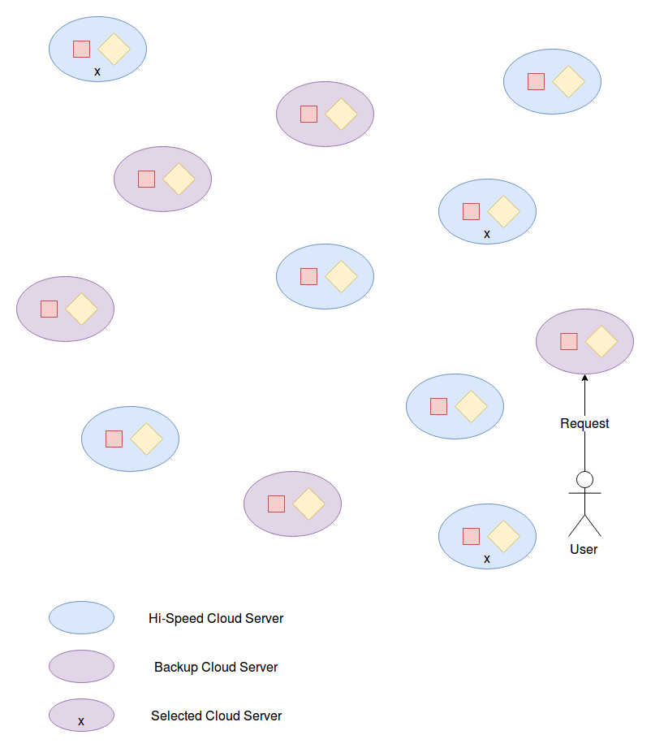

# Proposal New Model For MCOS Distributed System

## MCOS Ring Problem

Trong hệ thống tích hơp lưu trữ đa đám mây, một trong các vấn đề quan trọng nhất mà chúng ta cần phải giải quyết là: Cho một Data Object có ObjectID **x**, tìm ra các Cloud chứa các Replica của Data Object này.

## Giải pháp được sử dụng trong hệ thống MCS

Trong hệ thống MCS, vấn đề này được giải quyết bằng giải pháp sử dụng virtual Cloud Server kết hợp với Consistent Ring (Chord Ring) - kế thừa từ ý tưởng sử dụng trong Swift:

<https://github.com/HPCC-Cloud-Computing/CAL_Appliances/blob/mcs/architect/MCS/docs/cac_mo_hinh_anh_xa_CloudID_ObjectID.md#4-m%C3%B4-h%C3%ACnh-cloud-ring-with-reference-node>

CloudID | Type | Access\_Data
--------|------|-------------
1 | Amazon\_S3 | User:x1 - Password:x1\_pass
2 | Swift | User:x2 - Password:x2\_pass - ServerIP:x2\_IP
3 | Swift | User:x3 - Password:x3\_pass - ServerIP:x3\_IP
4 | Swift | User:x4 - Password:x4\_pass - ServerIP:x4\_IP
5 | Amazon\_S3 | User:x5 - Password:x5\_pass
6 | Swift | User:x6 - Password:x6\_pass - ServerIP:x6\_IP

Trong mô hình này, đầu tiên chúng ta cần xác định số lượng virtual server của một Cloud Server, tham số này tỉ lệ thuận với dung lượng lưu trữ của Cloud Server đó, và tổng số lượng virtual server của tất cả các Cloud Server bằng với số lượng node trên Ring * số lượng virtual server được gán vào một node.

Ví dụ, với Ring có số node = 8 và hệ số virtual_server/node = 3 thì:

Cloud\_Server |Weight (GB)           |Virtual\_Servers\_Number
--------------|----------------------|----------------------
1 | 400|4
2 | 300|3
3 | 400|4
4 | 600|6
5 | 500|5
6 | 200|2

Sau khi xác định được các Virtual Server tương ứng với từng Cloud Server, chúng ta sẽ đặt các Virtual Server này lên các node trên Ring, sao cho không thể xuất hiện 2 Virutal Server của một Cloud Server nằm trên cùng một node.

## Vấn đề đối với mô hình/ giải pháp hiện tại

- Một trong các hạn chế của giải pháp mà chúng ta vừa phân tích ở trên, đó là trong giải pháp này, sau khi đã xác định được các virtual server, thì chúng ta đã coi rằng các virtual server này có vai trò tương đương nhau trong hệ thống. Nhưng thực tế thì không phải là như vậy:

Các virtual server đóng vai trò là con trỏ đại diện cho các Cloud Server trên thực tế. Mà trong thực tế, thì sự khác biệt khi so sánh giữa các Cloud Server với nhau không chỉ nằm ở dung lượng lưu trữ (như đã trình bày ở phía trên), mà còn nằm ở nhiều yếu tố khác. Ví dụ, khoảng cách (độ trễ mạng) từ từng Cloud Server tới MCS API Server là khác nhau

- Trong giải pháp hiện tại, với khoảng cách từ các Cloud Server tới MCS API Server là như phía trên, thì chúng ta có thể thấy tốc độ truy cập vào một Data Object x1 tương ứng với Node N0 trên Ring (trên các Cloud Server 1,2,3) sẽ nhanh hơn tốc độ truy cập của Data Object x2 tương ứng với Node N5 trên Ring, cho dù về bản chất 2 vai trò của 2 Data Object này là tương đương nhau trên hệ thống. Việc coi các virtual server là tương đương nhau dẫn tới sự mất đi tính công bằng trong hệ thống.

- Hạn chế thứ hai của giải pháp hiện tại, đó là tất cả các Cloud Server đều được quản lý bởi một Ring duy nhất. Cho dù chúng ta có thể sử dụng giải pháp sử dụng Load Balancer, sau đó tạo ra nhiều MCS API Server phía đằng sau, nhưng nhìn chung trên thực tế, giải pháp này không có tính scalable. Lý do là nếu như hệ thống này được thiết kế để phục vụ nhiều người dùng tại các vị trí khác nhau, thì tất cả các người dùng sẽ đều phải sử dụng chung một entry-point. Lúc này, những người ở gần entry-point sẽ được phục vụ tốt hơn những người nằm ở xa entry-point.

Từ hai vấn đề trên, thầy Minh yêu cầu em xác định một mô hình mới cho bài toán lưu trữ Object Storage đa đám mây. Mô hình mới của em đề xuất như sau:

## Mô hình mới cho bài toán Multi-Cloud Object Storage

Mô hình mới của bài toán Multi-Cloud Object Storage bao gồm 3 nội dung chính sau:

### 1. Mô hình triển khai tổng quan của hệ thống MCOS

Trong mô hình mới, MCOS được nhìn nhận như một hệ thống phân tán trải khắp trên các Cloud Server, mỗi một Cloud Server sẽ được triển khai thêm một MCOS server đóng vai trò là service thực hiện việc "kết nối" các Cloud Server với nhau, cũng như xử lý các yêu cầu của người dùng

### 2. Xác định các thuộc tính của một Cloud Server trong hệ thống MCOS

Trong hệ thống MCS, các Cloud Server được coi là gần như tương đồng với nhau, sự khác biệt giữa các Cloud Server chỉ nằm ở tính chất Dung lượng lưu trữ của các Cloud Server là khác nhau.

Trong mô hình mới của bài toán MCOS, thầy Minh yêu cầu xác định các tính chất quan trọng của  một Cloud Server. Theo em, một Cloud Server có các tính chất sau:

- Vị trí (tọa độ) nơi đặt Cloud Server
- Khả năng phục vụ của Cloud Server:
    - Băng thông đường truyền.
    - Số lượng request có thể xử lý trong một đơn vị thời gian.
    - Loại hình lưu trữ (SSD/HDD)
    - Dung lượng
- Chi phí duy trì/sử dụng Cloud Server ($/GB/Hour)
- Trạng thái của Cloud Server: Active/Deactive (Thầy Minh bổ sung)

### 3. Xác định lại các yêu cầu của người dùng đối với hệ thống lưu trữ Multi-Cloud Object Storage

Với góc nhìn mới về hệ thống được trình bày như ở trên, chúng ta sẽ xác định lại các nhu cầu của người dùng đối với hệ thống MCOS:

- Yêu cầu cơ bản: Khi người dùng tải lên một Data Object **x**, Hệ thống cần replicate Data Object đó ra **k** (k>=1)  Data Object replica và k replica này cần phải được đặt trên k Cloud Server khác nhau.
- Các yêu cầu chi tiết:
    - Hệ số k có thể thay đổi được ?
    - Người dùng muốn k Cloud Server này nằm gần MCOS Services mà người dùng đã gửi request đến.****
    - Người dùng muốn k replica này được phân bố đều trên toàn bộ hệ thống.
    - Người dùng muốn tất cả K Cloud Server này nằm trên các Cloud Server có tốc độ cao
    - Người dùng muốn **t** replica trong k replica nằm trên 1  Cloud Server có tốc độ cao , và **k-t** replica còn lại nằm trên các Backup Cloud Server (tốc độ chậm / Dung lượng lưu trữ lớn)
    - Người dùng muốn toàn bộ các replica nằm trên các Backup Cloud Server.
    - Người dùng muốn lưu trữ các replica trên các Cloud Server có chi phí nhỏ nhất
    - Người dùng muốn tối ưu hóa tốc độ truy cập vào replica.

Hoặc yêu cầu của người dùng có thể là sự tổng hợp của các yêu cầu trên, ví dụ:
        
- Hệ số: k=4
- Vị trí: Trong các Cloud Server gần vị trí của người dùng nhất
- Chế độ lưu trữ: 2 replica nằm ở trên các Cloud Server tốc độc cao, 2 replica còn lại nằm trên các Backup Cloud Server

hoặc

- Hệ số: k=3
- Vị trí: Phân tán đều trên toàn bộ hệ thống
- Chế độ lưu trữ: Tất cả các replica nằm trên các Cloud Server tốc độ cao.

Ý tưởng: Phân cụm các Cloud Serer đang có trên hệ thống.