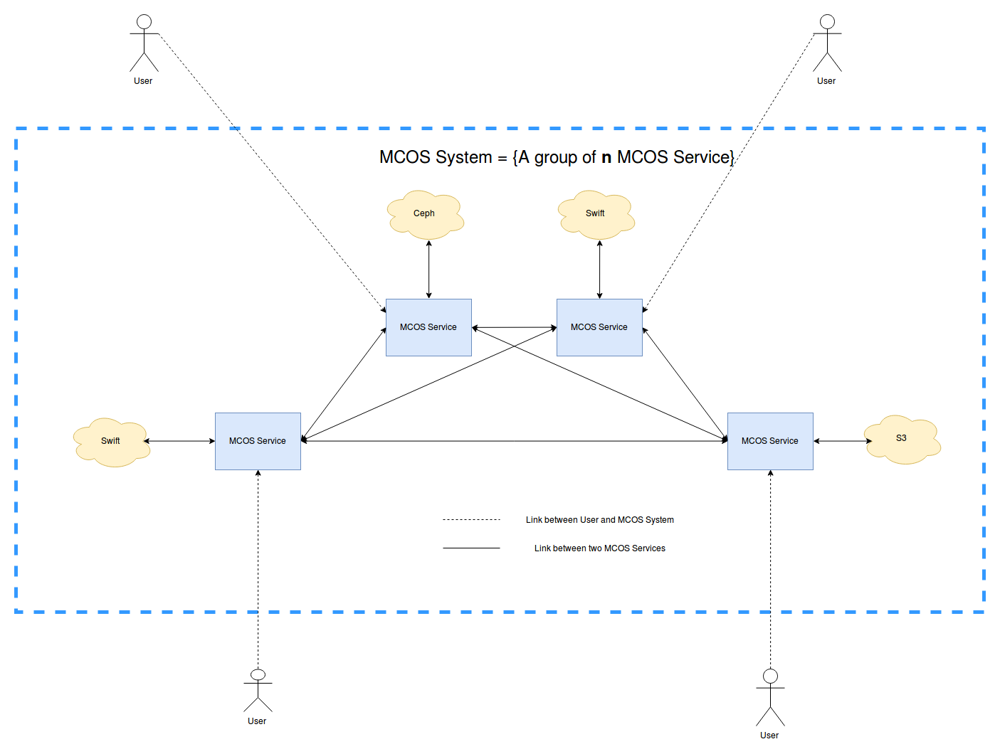
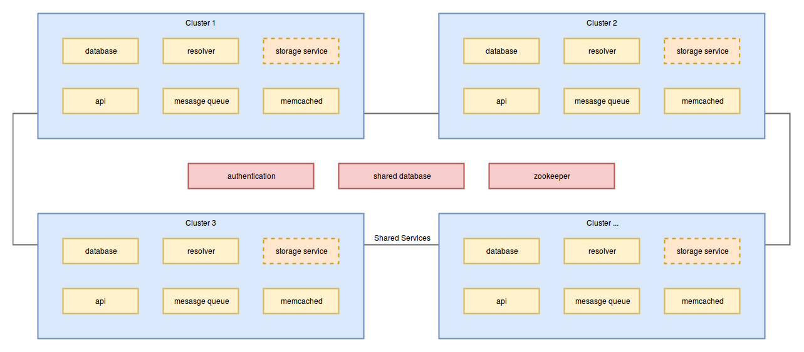
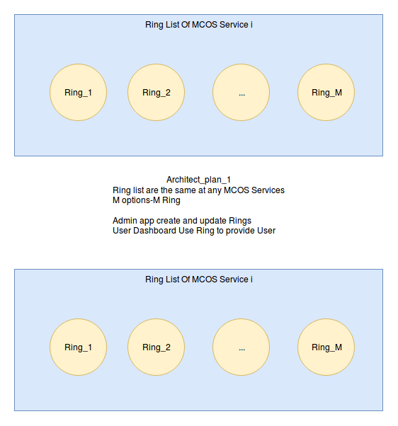
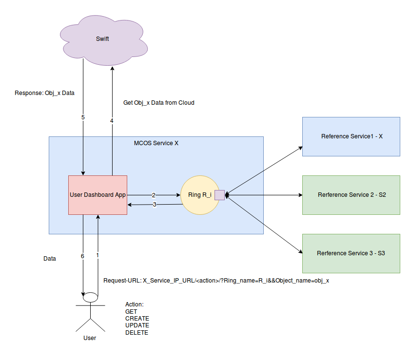
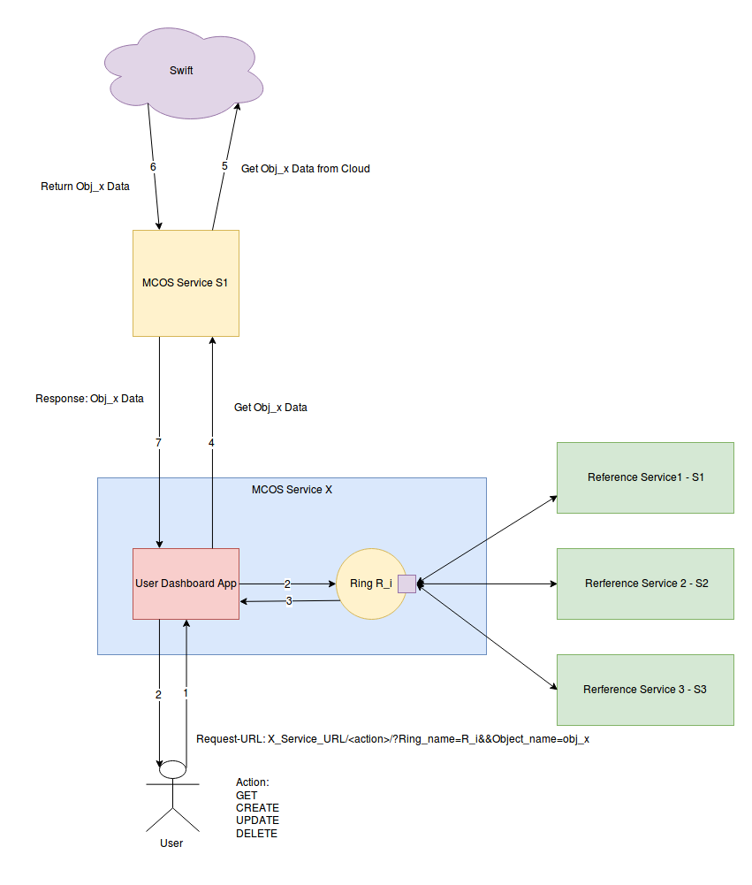
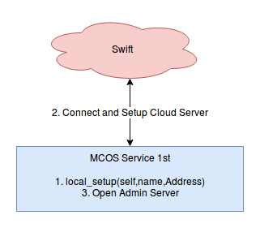
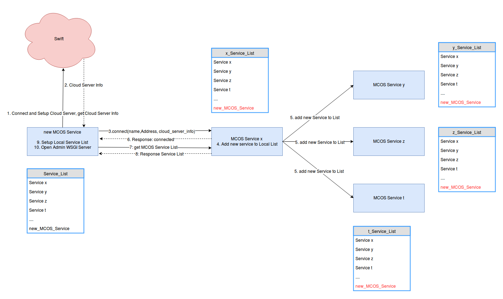

# Kế hoạch xây dựng hệ thống MCOS

## Mô hình tổng quan hệ thống MCOS (xây dựng lại theo mô hình ngang hàng - loại bỏ thành phần controller service)

Hệ thống MCOS System là một tập hợp các Service có nhiệm vụ liên kết các Cloud Server có các đặc điểm, vị trí khác nhau tạo thành một kho lưu trữ thống nhất,và cung cấp giao diện cho người dùng bên ngoài .

Đứng từ góc nhìn bên ngoài là User, MCOS được nhìn nhận như là một kho lưu trữ đơn nhất có **n** cổng truy cập. Và giao diện, dịch vụ cũng như dữ liệu mà người dùng nhận được từ kho lưu trữ là như nhau ở bất kỳ cổng truy cập nào. 

Đứng từ góc nhìn bên trong, MCOS là một hệ thống bao gồm N **MCOS Service** được kết nối với nhau. Mỗi một MCOS Service được kết nối để đại diện cho một Cloud Server. Chúng ta có N Cloud Server thì cũng sẽ có N MCOS Cloud Service. Mỗi cổng truy cập được mở cho bên ngoài là do một MCOS Service tạo ra.

Trong hệ thống MCOS có hai loại kết nối chủ yếu: Kết nối giữa User tới MCOS Service và kết nối giữa các MCOS Service với nhau.

Về cơ bản, một MCOS Service là một Web Server gồm 2 module: Module Admin và Module User và một thành phần khác là các Ring được sử dụng để xác định vị trí của các bản sao của một Data Object. 

- Module Admin: Phục vụ các công việc:
    1. Thiết lập kết nối giữa các MCOS Service với nhau
    1. Cung cấp giao diện quản lý cho người quản trị hệ thống theo dõi trạng thái của hệ thống, trạng thái của các Service và các Cloud Server trong hệ thống cũng như các thao tác quản trị hệ thống.
- Module User:
    1. Cung cấp cho người dùng User giao diện để tương tác với hệ thống, các API cho phép xem danh sách các File, create, update, delete, download các file.
    1. Cung cấp endpoint cho các MCOS service khác có thể tương tác với dữ liệu của User( sẽ đề cập tới nhiệm vụ này trong phần sau).(*)
- Để phục vụ việc xác định xem một Data Object của người dùng nằm trên các Cloud Server nào trên hệ thống, chúng ta sử dụng các Ring. Mỗi một Options trên hệ thống tương ứng với một Ring, hệ thống có M options thì cũng sẽ có M Ring tương ứng, và M Ring này là giống nhau hoàn toàn trên bất kỳ MCOS Service nào, điều đó có nghĩa là thành phần Ring List của một MCOS Service bao gồm M Ring. Và Ring List của MCOS Service i giống hoàn toàn với Ring List của MCOS Service j. (Đây là phương án hiện tại của em.)

## Quá trình hệ thống phục vụ một Request của User

Các bước của quá trình phục vụ một Request của User để lấy về nội dung của một Data Object có object name là **obj\_x** được lưu trữ theo **Option R\_i** của MCOS System diễn ra như sau:

1. User gửi Request tới Một endpoint của MCOS System - Tức là gửi Request tới Một MCOS Service X nào đó trong N MCOS Service của hệ thống. Nội dung Request bao gồm các thông tin sau:
    - Địa chỉ của MCOS Service X: X\_Service\_IP\_URL
    - Tên/mã của Option mà User đã chọn khi tạo Data Object: R_i
    - Tên của Data OBject: Obj\_x
1. MCOS Service X nhận được Request, tìm đến Ring R\_i để xác định xem các bản sao của Obj\_i nằm trên các Cloud Server\Service nào.(Vì trong thiết kế hiện tại, Một Cloud Server được đại diện duy nhất bởi một Cloud Service).
1. Lúc này, xảy ra hai trường hợp sau
    - Trường hợp 1: Có một bản sao nằm trên Chính MCOS Service X. Nếu như Bản sao này đang ở trạng thái hợp lệ, MCOS Service X Sẽ kết nối tới Cloud Server mà nó đại diện để lấy nộ dung của bản sao này về và trả về cho người dùng.
    - Trường hợp 2: Các bản sao nằm trên các Cloud Service khác. Lúc này X sẽ chọn ra một trong số các MCOS Service giữ bản sao (giả sử chọn MCOS Service **S1** ) và gửi request tới **S1** (đây là lý do tại sao trong phần User lại có thêm chức năng (*). **S1** nhận được request từ **X**, thực hiện việc kết nối tới Cloud Server mà nó đại diện để lấy nội dung của Obj\_x về rồi gửi về cho **X**. X nhận được nội dung của Obj\_x, thực hiện việc đóng gói và trả về cho người dùng.

--> Một phương án thiết kế khác là Người dùng sẽ không cần truyền lên Option của Data Object mà chỉ truyền lên tên của Data Object. Lúc này nhiệm vụ tìm xem Data Object có tên là Obj\_x nằm ở Option nào sẽ do MCOS Service nhận request phân giải.

Sơ đồ thực hiện 2 trường hợp được mô tả như sau:

## Các giai đoạn thiết lập hệ thống từ lúc Cloud Service đầu tiên được khởi động cho tới khi hệ thống bắt đầu phục vụ end user

Dự kiến quá trình thiết lập hệ thống sẽ được thực hiện như sau:

Bước 1: Khởi động các MCOS Service. Thiết lập kết nối giữa các MCOS Service. 

Kết quả đầu ra sau khi thực hiện xong bước 1: Trên mỗi một MCOS Service trên hệ thống đều có được danh sách **Service\_List** chứa thông tin về N MCOS Service. Mỗi phần tử **x** trong danh sách Service\_List bao gồm các thông tin về một MCOS Service **x** trong hệ thống:

- Tên
- Địa chỉ (IP+ Port)
- Tình trạng hiện tại (ACTIVE/SHUTOFF/DISCONNECTED)
- Khoảng cách từ MCOS **x** tới các MCOS Service còn lại trên hệ thống
- Thông tin về Cloud Server mà **x** đang đại diện:
    - Dung lượng
    - Tốc độ I/O
    -...

Có 2 phương án thực hiện bước 1.

Phương án 1: Theo tư tưởng hệ thống phân tán:

- Đẩy mã nguồn MCOS Service lên N Máy chủ
- Khởi động MCOS Service đầu tiên, với cấu hình config là local\_setup:

**Local\_setup diễn ra như sau:**

1. lấy tên và địa chỉ của chính nó từ file config.
1. Kết nối tới Cloud Server mà nó đại diện để lấy thông tin về Cloud Server đó.
1. Sử dụng các thông tin trên tạo ra phần tử đầu tiên của danh sách Service List
1. Mở Admin WSGI Server

- Khởi động MCOS tiếp theo, với cấu hình config là remote\_setup

**Remote\_setup trên MCOS Service j diễn ra như sau:**

1. MCOS Service j Kết nối và lấy thông tin về Cloud Server j mà nó sẽ đại diện.
1. MCOS Service j Gửi các thông tin về Cloud Server j, tên và địa chỉ của chính nó tới một trong số các MCOS đã tham gia hệ thống (ở đây j gửi tới x).
1. x nhận được thông tin từ j, tiến hành thêm j vào danh sách local Service List của bản thân nó, đồng thời gửi thông tin của j tới các MCOS Server còn lại trong hệ thống. Các MCOS Service còn lại nhận được thông điệp do x gửi tới sẽ thực hiện việc thêm j vào local Service List của nó. Sau đó x gửi phản hồi cho j.
1. j kết nối tới x để lấy danh sách các Service hiện tại đang có trên hệ thống
1. j thực hiện việc tạo local Service List cho riêng nó
1. j thực hiện việc mở Admin WSGI Server

Phương án 2:

- Nạp thông tin của toàn bộ N MCOS Cloud Service vào file conf trong mã nguồn.
- Đẩy mã nguồn lên N máy chủ.
- Khởi động các MCOS Service, bật AdminServer. 
- Sau một khoảng thời gian t=10 phút, thực hiện việc kiểm tra kết nối giữa các máy chủ.

Bước 2: Khởi tạo Ring cho các Options

- Sau khi tập hợp các Cloud Service trong hệ thống đạt tới một trạng thái nhất định, tiến hành việc khởi tạo Ring List trên các MCOS Service một cách tự động hoặc thủ công (Do người quản trị hệ thống kích hoạt quá trình).

Bước 3: Bật User Server trên các MCOS Service.

- Sau khi khởi tạo xong Ring List cho các Service, tiến hành enable User Server trên các MCOS Service. Sau bước này, người dùng User có thể sử dụng các dịch vụ mà User Server cung cấp.

## Các giai đoạn chính trong kế hoạch và milestone của từng giai đoạn

### Giai đoạn 1: Xây dựng các thành phần liên quan tới bước 1: Khởi tạo hệ thống

- Giai đoạn 1: Xây dựng các thành phần cần thiết cho bước 1:
  1. Xây dựng các phương thức cần thiết cho quá trình khởi tạo một MCOS Service.
  1. Xây dựng phần Admin Server Phần API liên quan tới quá trình khởi tọa hệ thống.
  1. Xây dựng giao diện phần Admin theo dõi tình trạng hệ thống.
- Dự kiến thời gian thực hiện: 30tháng 7 - 20:30 tháng 8 (đang bắt đầu thực hiện)

### Giai đoạn 2: Thiết kế Ring List hệ thống

- Thiết kế danh sách các option sẽ cung cấp cho người dùng.
- Tìm các giải pháp xây dựng Ring cho từng Options. 
- Giải pháp thiết lập Ring List
- Dự kiến thời gian thực hiện: 20:30 tháng 8 - 20:30 tháng 10

### Giai đoạn 3: Thiết kế phần User Server

- Thiết kế giao diện cho người dùng
- Thiết kế các phương thức kết nối với Cloud Server, phương thức sử dụng Ring, phương thức kết nối tới các MCOS Service khác
- Xây dựng các thành phần thực hiện các công việc đã liệt kê trong phần **quá trình hệ thống phục vụ một Request của User** 
- Dự kiến thời gian thực hiện: 15:25 tháng 10 - 10:15 tháng 12

### Giai đoạn 4: Viết báo cáo đồ án tốt nghiệp.

- Dự kiến thời gian thực hiện: 10 tháng 12 - 25 tháng 12
