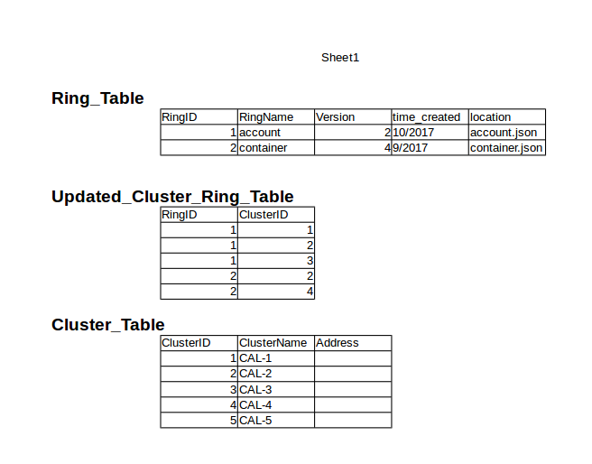

# Proposal Solution For Create And Distributed Ring Problem In MCOS System

Trong quá trình xây dựng hệ thống MCOS, một vấn đề xuất hiện cần phải giải quyết là: Làm sao để thực hiện thao tác tạo Ring và phân phối Ring được tạo ra tới các Cluster trong hệ thống MCOS, trong điều kiện trạng thái của hệ thống không ổn định mà thay đổi liên tục. Mô tả chi tiết về vấn đề được phát biểu như sau:

Tại thời điểm t, người quản trị hệ thống gửi request lên một trong các Cluster trên hệ thống yêu cầu hệ thống tạo Ring. Tại thời điểm này,đối với với Cluster nhận request, đang có **x** Cluste, và trong **x** Cluster này có **x1** Cluster đang ở trạng thái Active, và **x2** Cluster đang ở trạng thái InActive. Tại thời điểm **t + delta\_t** sẽ có thêm một cluster kết nối vào hệ thống. Tại thời điểm **t +delta\_t\_i** một Cluster trong số các Cluster đang Inactive sẽ kết nối trở lại hệ thống. 

Vấn đề cần giải quyết ở đây là làm sao để Các Cluster Inactive sau khi kết nối trở lại hệ thống, cũng như các Cluster mới kết nối tới hệ thống nhận được Ring được tạo ra tại thời điểm **t**. Một vấn đề khác đi cùng vấn đề này, đó là khi một Ring nào đó được cập nhật, chúng ta cũng cần phải gửi Ring mới tới các Cluster trên hệ thống.

Đề xuất giải pháp mới:

Trên Database của mỗi cluster sẽ duy trì cơ sở dữ liệu về các Ring và trạng thái của Ring tại các cluster trên hệ thống:

Dựa trên 3 table này, tại một cluster bất kỳ trong hệ thống có thể xác định được với 1 Ring **x** đã có bao nhiêu cluster có được Ring này. Từ đó xác định ra các Ring chưa có thông tin về Ring này.

Giải thuật được xây dựng như sau: Định kỳ sau khoảng thời gian delta_t, tại 1 cluster **x** trên hệ thống sẽ tiến hành kiểm tra thông tin từ cơ sở dữ liệu, từ đó xác định với từng Ring mà nó có đã có bao nhiêu cluster có được thông tin về Ring đó. Xác định ra đối với Cluster đang xét thì các cluster nào chưa có thông tin về Ring này, xem trong các cluster này các cluster **k** nào đang ở trạng thái Active, thì cluster **x** sẽ gửi thông điệp chứa thông tin về ring tới cluster **k**.

Một cluster nhận được thông điệp chứa Ring sẽ thực hiện 2 công việc:

- Nếu Ring chưa có trong Cluster đó, tiến hành thêm Ring đó vào hệ thống.
- Nếu cluster gửi Ring chưa có trong dánh sách các Cluster đã cập nhật Ring (bảng **Cluster_Table**), thêm cluster gửi Ring vào table này.

Thuật toán dừng lại đối với Ring **i** nếu tại cluster **x** bất kỳ trên hệ thống, cluster **x** đã biết được rằng các cluster khác đã có được Ring **i**.

Độ phức tạp của thuật toán là O(**m**x**n^2**), với m là số lượng Ring, và n là số lượng cluster có trong hệ thống.