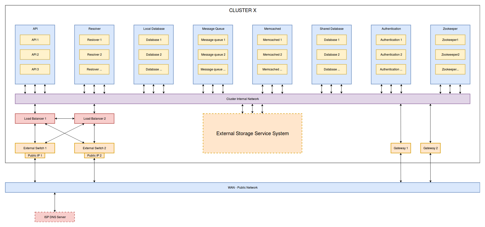
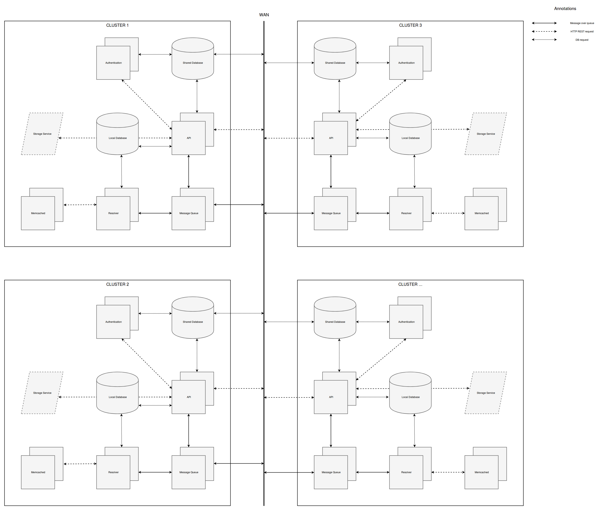

# Review MCOS Architect

## Giới thiệu đề tài

Để đáp ứng được nhu cầu lưu trữ và truy cập dữ liệu ngày càng tăng từ các người dùng internet, các nhà cung cấp dịch vụ lưu trữ đã và đang sử dụng các hệ thống object storage để lưu trữ các dữ liệu phi cấu trúc, các file ảnh, video, tài liệu,....vv của người dùng. Theo thời gian, phương thức lưu trữ Object Storage ngày càng phát triển và phổ biến, dẫn tới việc có nhiều nhà cung cấp hệ thống lưu trữ Object Storage khác nhau có mặt trên thị trường với nhiều loại giao tiếp API khác nhau, từ đó xuất hiện một số vấn đề cần giải quyết trong thực tế: 

- Vấn đề thứ nhất: Khi một tổ chức sử dụng nhiều hệ thống lưu trữ Object Storage từ nhiều nhà cung cấp khác nhau với nhiều loại API khác nhau, thì làm sao để có thể tích hợp được nhiều loại hệ thống lưu trữ Object Storage trên thành một hệ thống lưu trữ thống nhất, với một giao diện sử dụng đồng nhất, với các khả năng phân tán và scalable? 

Để giải quyết bài toán nói trên, dựa trên bài báo về Cloud Abstraction Layer của TS. Nguyễn Bình Minh, nhóm nghiên cứu của trung tâm HPCC đã phát triển thư viện CAL-plus cho phép các ứng dụng viết bằng ngôn ngữ python có thể tương tác với các hệ thống Object Storage của nhiều nhà cung cấp khác nhau. Dựa trên thư viện này, anh Nguyễn Tuấn Kiên K57 đã thực hiện thành công đồ án sử dụng cơ chế Chord Logic Ring để xây dựng một hệ thống lưu trữ thống nhất trên nền nhiều hệ thống Object Storage khác nhau. Tuy nhiên, một hạn chế của hệ thống này, đó là tất cả hệ thống được xây dựng thành một API Service, do đó hệ thống này chưa có khả năng phân tán và scalable tốt.

- Vấn đề thứ hai: Khi tích hợp nhiều hệ thống Object Storage khác nhau vào cùng một hệ thống chung nhất, thì tuy rằng các hệ thống này đều thuộc cùng một phương thức, cơ chế lưu trữ là Object Storage, tuy nhiên khi xét riêng từng hệ thống, từng hệ thống Object Storage thì chúng sẽ có đặc điểm khác nhau, phụ thuộc vào các đặc tính đặc trưng của hệ thống, đó là các đặc điểm về vị trí đặt hệ thống, đường truyền, băng thông, độ trễ của kết nối mạng, hiệu năng lưu trữ của hệ thống: Số lượng server, số lượng ổ đĩa, loại ổ đĩa sử dụng, cấu hình máy chủ, cơ chế sao lưu, mức độ bảo mật... Những sự khác nhau này đã đặt ra một vấn đề, đó là khi lưu trữ 2 data object giống nhau lên hệ thống lưu trữ thống nhất, thì 2 data object này có thể được lưu trữ tại 2 hệ thống Object Storage thành viên có các đặc điểm giống nhau, từ đó dẫn đến là tuy chúng ta truy cập và tương tác với 2 Data Object này thông qua một giao diện đồng nhất, nhưng các đặc điểm chất lượng dịch vụ (Quality Of Service) khi chúng ta tương tác với 2 Data Object này sẽ khác nhau. Ví dụ, tốc độ truy cập một data object được lưu trữ tại hệ thống Object Storage có cấu hình cao sẽ thường cho tốc độ tốt hơn một data object được lưu trữ tại một hệ thống Object storage có cấu hình thấp. Một ví dụ khác, tốc độ truy cập của người dùng Việt Nam vào một data object lưu trữ tại hệ thống đặt ở Việt Nam sẽ thường cao hơn một data object được lưu trữ tại hệ thống đặt ở châu Âu.

Từ sự khác biệt này, đặt ra bài toán, đó là chúng ta cần tạo ra các tập máy chủ có đặc tính tương tự nhau thành một cụm và tạo ra tùy chọn lưu trữ tương ứng với tập máy chủ đó, tức là tạo ra một số lựa chọn cho người dùng khi người dùng tạo ra 1 data Object trên hệ thống, để cho phép khi người dùng tạo một data object với một option cho trước, thì việc truy cập vào data Object này sẽ đạt được một số tính chất theo mong muốn của người dùng, trong khi vẫn đảm bảo việc truy cập từ bên ngoài vào bất kỳ data Object nào trên hệ thống là đồng nhất và trong suốt.

Mục tiêu mà đồ án hướng tới, đó là phát triển một hệ thống lưu trữ phân tán tích hợp các hệ thống Object Storage khác nhau thành một hệ thống lưu trữ thống nhất có khả năng giải quyết được 2 vấn đề đã nêu ra, dựa trên sự kế thừa từ đồ án của anh Kiên - hệ thống Multi Cloud Object Storage (MCOS). Các mục tiêu chính mà hệ thống MCOS cần đạt được là:

- Kết nối, tích hợp các hệ thống lưu trữ Object Storage khác nhau thành một hệ thống lưu trữ thống nhất.
- Đảm bảo các tính chất Distributed, High-Available, Scalable và Fault Tolerance cho hệ thống MCOS.
- Cung cấp khả năng cho người dùng hệ thống lựa chọn tùy chọn khi lưu trữ một Data Object lên hệ thống, trong khi vẫn đảm bảo việc truy cập vào các Data Object trên hệ thống là trong suốt và đồng nhất với người dùng.

Với các mục tiêu đề ra, chúng ta sẽ đi vào phân tích và thiết kế các thành phần cho hệ thống.

## Phân tích thiết kế hệ thống MCOS

Để đạt được các mục tiêu đã đề ra, hệ thống MCOS sẽ được thiết kế theo mô hình phân tán. Với mục tiêu quan trọng nhất là tích hợp các hệ thống Object Storage khác nhau vào thành một hệ thống lưu trữ thống nhất, thì tài nguyên quan trọng nhất mà hệ thống cần quản lý chính là các hệ thống Object Storage thành viên. Dựa trên cơ sở này, mô hình được lựa chọn để xây dựng hệ thống MCOS là mô hình ngang hàng peer-to-peer. Một trong các đặc điểm của mô hình peer-to-peer, đó là chúng ta có thể xây dựng các cơ chế cho phép hệ thống có khả năng chịu lỗi, trong trường hợp một trong số các thành phần trên hệ thống gặp sự cố. 

Sử dụng mô hình peer-to-peer, đồ án đề xuất thiết kế mức cao của hệ thống là: Hệ thống MCOS là một tập hợp bao gồm **n** MCOS cluster, mỗi cluster trong hệ thống có vai trò đại diện, tương tác và quản lý một hệ thống Object Storage thành viên, đồng thời chúng ta sẽ tạo ra các cơ chế cho phép các cluster trong hệ thống phối hợp với nhau trong một số tác vụ chung. Để làm được điều đó, thiết kế của mỗi cluster là giống nhau, mỗi cluster sẽ bao gồm 1 tập các hệ thống con được sử dụng để tương tác và quản lý với một hệ thống Object Storage thành viên, đồng thời bên cạnh đó, hệ thống sẽ xây dựng một số service-hệ thống con được chia sẻ sử dụng chung giữa các cluster, cho phép các thông tin chung giữa các cluster trong hệ thống được xử lý đồng nhất tại một chỗ.

Dựa trên quan điểm này, chúng ta tiếp tục phân tích xem hệ thống của chúng ta cần thực hiện các công việc gì, từ đó xác định các thành phần phù hợp để thực hiện các công việc đó, đồng thời xác định cách phân bố các thành phần đảm bảo tính phân tán, tính sẵn sàng cao cũng như tính chịu lỗi của hệ thống.

### Phân tích các tác vụ mà hệ thống MCOS cần thực hiện

Trong phần này, các thành phần của hệ thống MCOS sẽ được đề xuất dựa trên việc tiếp tục phân tích vào các tác vụ chính được thực hiện trong hệ thống MCOS.

- Hệ thống MCOS là một hệ thống phân tán bao gồm nhiều cluster, nhiều service kết nối và phối hợp với nhau khi thực hiện các tác vụ. Vì vậy, để thiết lập sự tương tác giữa các cluster của hệ thống MCOS với nhau, giữa các service với nhau, chúng ta cần sử dụng thành phần có vai trò điều phối hoạt động giữa các cluster, và các service có vai trò truyền thông - kết nối giữa các cluster với nhau, cũng như truyền thông giữa các service của cùng 1 cluster. Đồng thời, giữa các cluster vẫn có các thông tin chung như thông tin xác thực của người dùng, thông tin phục vụ cho việc quản lý hệ thống, đồng bộ dữ liệu... Chính vì vậy chúng ta cần có một cơ sở dữ liệu chung cho tất cả các cluster.

Như vậy chúng ta cần các service thực hiện điều phối - coordinator service, service xác thực authentication service, cơ sở dữ liệu chung cho hệ thống - shared database, service thực hiện việc truyền thông kết nối các, các service trong hệ thống - ở đây chúng ta sử dụng message queue service.

Để cung cấp các tài nguyên dịch vụ cho người dùng đầu cuối lưu trữ và truy cập các Data Object, hệ thống cần có các API service cung cấp giao diện tương tác cho người dùng. Các API service này sẽ cần tiếp nhận và lưu trữ dữ liệu của người dùng lên các hệ thống Object Storage thành viên. Tuy nhiên, có một yêu cầu mà hệ thống MCOS cần giải quyết khi lưu trữ dữ liệu của người dùng, đó là chỉ ra dữ liệu của người dùng nằm trên hệ thống Object Storage thành viên nào. Lý do ở đây, là vì tuy chúng ta cần lưu trữ một data object trên nhiều hệ thống Object Storage, tuy nhiên hệ thống sẽ chỉ lưu các bản sao này tại một tập con của tập các hệ thống Object Storage thành viên, chứ không lưu tại tất cả các Object Storage thành viên, để phù hợp với nhu cầu lưu trữ dựa theo tùy chọn đã nêu ra phía trên, cũng như đảm bảo dung lượng sử dụng để lưu trữ một data object là vừa đủ để sao lưu data object, nhưng cũng không quá dư thừa làm lãng phí dung lượng lưu trữ. Vì vậy, chúng ta cần có một cơ chế để xác định xem một data object có định danh xác định sẽ có dữ liệu nằm trên các hệ thống Object Storage nào trong số các hệ thống Object Storage thành viên. Service thực hiện nhiệm vụ này là Resolver service. Resolver service cũng sẽ thực hiện nhiệm vụ xử lý các rpc request từ các cluster khác gửi tới. Bên cạnh đó, vì Resolver service chịu một khối lượng công việc rất lớn, và cũng do thông tin định tuyến cho các Resolver service này là giống nhau giữa các Resolver Service của một cluster, do đó để tăng tốc quá trình xử lý của các Resolver Service, thông tin định tuyến sẽ được lưu trữ trên một service có tốc độ đọc ghi cao sử dụng bộ nhớ RAM - memcache service.

Đồng thời. tương tự như các Object Storage thành viên của MCOS, các Cluster trên hệ thống cũng sẽ có một số đặc điểm khác biệt lẫn nhau chứ không đồng nhất, đồng thời, một số loại dữ liệu cuả người dùng cũng sẽ được phân tán trên hệ thống ở nhiều nơi khác nhau. Để lưu trữ các thông tin đó, chúng ta sẽ cần có một cơ sở dữ liệu riêng cho từng Cluster.

Như vậy, chúng ta thấy rằng trên từng cluster của hệ thống MCOS sẽ cần có thêm các service sau:
Service cung cấp tài nguyên cho người dùng cuối - Authentication service, service định tuyến data object - Resolver Service và Memcache service, local Database cho từng cluster.

Chúng ta đã xác định được các service sẽ có trên hệ thống MCOS. Tiếp theo, các service này sẽ được sắp xếp và thiết lập kết nối với nhau,các kết nối giữa các cluster với nhau sẽ được tạo ra, sau đó mô hình kiến trúc của hệ thống MCOS sẽ được trình bày.

### Mô hình kiến trúc của hệ thống MCOS

Mô hình kiến trúc của hệ thống MCOS được thể hiện bằng 3 biểu đồ sau:

- Biểu đồ khái quát mô hình chung và các thành phần, các services mà hệ thống MCOS có:

- Sơ đồ triển khai của hệ thống MCOS tại 1 cluster:

- Sơ đồ tương tác giữa các thành phần và giữa các service trong hệ thống:

### Thiết lập các cơ chế phối hợp hoạt động giữa các cluster 

### Giải quyết vấn đề cần tạo ra các lựa chọn lưu trữ cho người dùng

### Định nghĩa storage properties based group

Như đã giới thiệu ở phần trước, vấn đề tạo ra nhiều lựa chọn lưu trữ cho người dùng là kết quả của sự tương ứng giữa nhu cầu lưu trữ đa dạng của người dùng hệ thống lưu trữ dữ liệu với sự khác biệt về đặc điểm, hiệu suất và tính chất giữa các hệ thống Object Storage tới từ những nhà cung cấp khác nhau. Để giải quyết vấn đề này, hệ thống MCOS sẽ có một cơ chế cho phép tập hợp một nhóm các hệ thống Object Storage thành viên có chung một tính chất về cấu hình, hiệu suất, vị trí... lại thành một nhóm tương ứng với một tùy chọn lưu trữ Data Object, gọi là **storage properties based group**. Hệ thống sẽ có nhiều **storage properties based group** khác nhau, đồng thời một hệ thống Object Storage thành viên có thể có mặt trong nhiều **storage properties based group** cùng một lúc.

Bên cạnh đó, việc lưu trữ các Data Object của hệ thống MCOS cần được tối ưu hóa về dung lượng bộ nhớ sử dụng để lưu trữ dữ liệu, về mức độ an toàn của dữ liệu và về tốc độ đọc ghi của dữ liệu. Để đạt được các tiêu chí trên, khi cần lưu trữ một Data Object mới tương ứng với một **storage properties based group** xác định, cơ chế lưu trữ Data Object của hệ thống MCOS sẽ xác định **m** hệ thống Object Storage thành viên có trong option group đó, sau đó sẽ lựa chọn ra **k** trong số **m** hệ thống Object Storage (k<=m). Data Object mới sẽ được lưu trữ trên **k** hệ thống được chọn ra. Việc lưu trữ các bản sao một Data Object trên một số lượng nhỏ các  hệ thống Object Storage chứ không lưu trữ trên tất cả các hệ thống Object Storage của một option group cho phép các quá trình lưu trữ, đồng bộ và đọc ghi dữ liệu diễn ra với hiệu suất tốt hơn, cũng như tối ưu hóa dung lượng - khả năng lưu trữ của hệ thống, cũng như mức độ an toàn của dữ liệu - được đảm bảo thông qua hệ số sao lưu **k**.

Cơ chế xác định storage properties based group của hệ thống MCOS được khái quát hóa như sau:

Cho một tập hợp **n** Object Storage System **osg** = { _ss\_1, ss\_2, ..., ss\_n_ }. Mỗi một Storage System _ss\_i_ trong tập hợp trên có tập các đặc tính  b = { b1, b2,..., bn}, với bi (i= 1,n) có thể là:

- Độ trễ từ _ss\_i_ tới các Object Storage System khác trong mạng: **latency_arr[n]**, với **latency[j] = calculate_latency(ss\_i,ss\_j)**
- Số lượng request có thể xử lý trong một đơn vị thời gian.
- Loại hình lưu trữ (SSD/HDD)
- Dung lượng / dung lượng còn trống.
- Lượng request trung bình phục vụ
- Băng thông đường truyền tối đa/ băng thông đường truyền còn lại
- Chi phí duy trì Cloud Server ($/GB/Hour)
- Vị trí của hệ thống Object Storage
- ...

Một storage properties based group bao gồm các thành phần sau:

- Một tiêu chí **t** xác định đặc điểm của storage properties based group này.
- Hệ số sao lưu **k**
- Một tập Object Storage System thành viên là t_group = { tg\_1, tg\_2, ..., tg\_m } với tg\_i thuộc **osg**, sao cho fit(b\_i,**t**) = true với **fit** là hàm đánh giá độ phù hợp giữa tập thuộc tính của một object storage System với tiêu chí **t** của storage properties based group.

#### Xây dựng mô hình thử nghiệm hiệu suất của một Object Storage System

#### Thiết kế một số storage properties based group dựa trên hiệu suất của các Object Storage System

Sau khi thử nghiệm benchmark hiệu suất Object Storage System, chúng ta tiến hành xây dựng một số các storage properties based group.

Các đặc tính của một Object Storage System mà chúng ta có được thông qua benchmark là:

- 10KB Read-Write-IOPs - Response Time
- 2MB Read-Write-IOPs - Response Time
- 10MB Read-Write-IOPs - Response Time
- Capacity - Response Time
- Disk Type
- Storage Type

Dựa vào giá trị của các đặc tính trên ở từng Object Storage System, hệ thống MCOS sẽ xây dựng các các storage properties based group sau:

- Group big-file-economics: Phù hợp cho các file có kích thước lớn nhưng không cần tốc độ cao
- Group small-file-economics: Phù hợp cho các file có kích thước nhỏ nhưng không cần tốc độ cao
- Group small-file-optimize: Phù hợp cho các file có kích thước nhỏ và cần tốc độ truy cập cao
- Group big-file-optimize: Phù hợp cho các file có kích thước lớn và cần tốc độ truy cập cao
- Group speed-optimize: Phù hợp cho các file cần tốc độc cao

#### Thiết kế cơ chế lưu trữ và truy cập Data Object đáp ứng yêu cầu đa lựa chọn lưu trữ dữ liệu với storage properties based group

Sau khi đã thiết kế được các storage properties based group, chúng ta sẽ thiết kế cơ chế lưu trữ và truy cập dữ liệu của MCOS.
Theo thiết kế tổng quát mà chúng ta đã phân tích ở phía trên, khi một Data Object mới được tạo ra với định danh **d\_name** với một storage properties based group xác định **osg** = { t, k, t\_group }, hệ thống cần xác định ra k Object Storage trong osg sẽ lưu trữ các bản sao của Data Object mới này. Đồng thời, sau khi Data Object này đã được lưu trữ trên hệ thống, khi người dùng truy cập vào Data Object này bằng định danh **d\_name**, hệ thống cần phải tìm ra storage properties based group **osg** nào đang chứa Data Object này, sau đó tìm ra k Object Storage trong osg đang chứa các bản sao của Data Object này. Để giải quyết 2 bài toán này, MCOS sử dụng cơ chế **multi hashing ring**, được phát triển từ cơ chế **hashing ring** lookup được sử dụng trong hệ thống Swift Object Storage của OpenStack.

##### Cơ chế hashing ring trong OpenStack Swift

Hashing ring của Swift được tạo ra từ các thành phần là hệ số sao chép k, hệ số partition p và tập các phần tử lưu trữ t = { t1, t2, ..., tn } (k<=n). Hashing ring của swift sẽ chia ring, chính là toàn bộ không gian địa chỉ định danh của đối tượng cần được lookup thành 2^p vùng - hay 2^p partitions có kích thước bằng nhau. Mỗi một định danh bất kỳ sẽ chỉ thuộc vào duy nhất một miền trong 2^p miền trên. Mỗi miền trên ring sẽ tham chiếu tới k phần tử lưu trữ. Khi cần lookup một định danh d\_name của một đối tượng dữ liệu nào đó, Swift sẽ băm định danh đó bằng các hàm băm, sau đó lấy phần dư khi chia giá trị băm cho 2^p để xác định partition nào trên ring tương ứng với định danh này, sau đó lấy ra tập k phần tử lưu trữ của miền này. K phần tử lưu trữ này chính là nơi đang lưu trữ các bản sao của đối tượng dữ liệu mà chúng ta đang lookup.

Cơ chế hashing ring của Swift chia đối tượng dữ liệu thành 3 loại là account, container và object. Account data là đối tượng dữ liệu lưu trữ thông tin chỉ ra một account trên hệ thống có các container nào, container data là đối tượng dữ liệu lưu trữ thông tin chỉ ra một container của một account có các data object nào. Object data là đối tượng lưu trữ dữ liệu cơ sở cho người dùng, là một file hình ảnh, text, video,... được người dùng lưu trữ trên hệ thống. Tương ứng với 3 loại đối tượng dữ liệu trên, Swift sử dụng 3 ring: Account ring, container ring và object ring:

- Khi người dùng cần biết acccount của họ đang có các container nào, account ring được sử dụng để lookup lấy ra account data của người dùng.
- Khi người dùng cần biết một container của họ đang chứa các data object nào, account ring được sử dụng để lookup lấy ra container data tương ứng với định danh của container.
- Khi người dùng cần làm việc với một data object, object ring được sử dụng để lookup vị trí lưu trữ các bản sao của data object đó.

Phát triển cơ chế hashing ring lookup được sử dụng trong OpenStack Swift, hệ thống MCOS thiết kế cơ chế lưu trữ và truy cập dữ liệu sử dụng ring như sau:

##### Cơ chế sử dụng multi-hashing ring để lưu trữ và truy cập dữ liệu trong hệ thống MCOS

Tương tự như Swift, hệ thống MCOS cũng thiết kế để cho phép một account trên hệ thống chứa nhiều container, và một container chứa nhiều Data Object, do đó hệ thống MCOS cũng sử dụng một Account Ring và một Container Ring để lưu trữ và truy cập thông tin về account và container. Trong hệ thống MCOS, các đối tượng lưu trữ dữ liệu là các cluster trên hệ thống, thay vì là các ổ đĩa (Drive) như trong hệ thống OpenStack. Thêm vào đó, do sử dụng các storage properties based group trong việc lưu trữ các Data Object, do vậy cơ chế lookup của MCOS sẽ tạo ra cho mỗi storage properties based group một ring tương ứng để thực hiện lookup bên trong storage properties base group. Bên cạnh đó, hệ thống MCOS cũng xây dựng một cơ chế cho phép xác định storage properties based group nào trên hệ thống tương ứng với một data object có định danh t\_name trong số các storage properties based group, bằng cách sử dụng group\_resolver\_ring

Như vậy, trong hệ thống MCOS, chúng ta sẽ có 1 account ring, 1 container ring, 1 group\_resolver\_ring, và m object ring tương ứng với m storage properties based group. Một Ring bao gồm các thành phần sau:

- Tên ring
- Loại ring
- Ring version
- Tập Cluster List của Ring. Với account ring và container ring, tập này do người quản trị hệ thống xác định. Với các object ring, tập này là tập các cluster đại diện cho các Object Storage System nằm trong một storage properties based group xác định. Chúng ta có được điều này là do theo thiết kế hệ thống, thì một cluster trên hệ thống tương ứng với một Object Storage System duy nhất, hay chúng ta có liên kết 1-1 giữa 1 cluster trên hệ thống với một Object Storage System thành viên.
- Hệ số sao lưu **k**
- Hệ số partition **t**
- Danh sách partition_info bao gồm **2^t** phần tử, mỗi phần tử **i** trong danh sách chứa danh sách **k** phần tử thông tin Cluster, chỉ ra partition **i** của ring tham chiếu tới **k** cluster nào trong danh sách Cluster List của ring.

Để xử lý một tác vụ có liên quan tới account data có id là t\_account, service thực hiện tác vụ sẽ gửi yêu cầu phân giải tới Resolver service, Resolver service sẽ lấy account ring từ memcache service, sau đó băm account\_id để xác định account\_id đang xử lý thuộc partition nào, từ đó xác định các bản sao của account data đang xử lý đang nằm trên các cluster nào. Resolver gửi danh sách các cluster này về cho service gửi yêu cầu. Service này nhận được danh sách các cluster sẽ kiểm tra trạng thái hiện tại của cluster để xác định xem có thể kết nối tới cluster nào trong số các cluster trong danh sách, sau đó nó sẽ gửi request tới cluster đó để thực hiện tiếp các công việc còn lại trong tác vụ:

Quy trình xử lý một tác vụ liên quan tới container data có id là t\_container tương tự như quy trình xử lý account data:

Để xử lý một tác vụ về Data Object có id là t\_object, service thực hiện tác vụ sẽ gửi yêu cầu phân giải tới Resolver service. Lúc này Resolver service sẽ cần phải xác định xem t\_object nằm trong ring nào trong số m Object Ring, tức là object này tương ứng với storage properties base group nào, bằng cách sử dụng group resolver ring. Resolver sẽ lấy group resolver ring từ Memcache Server, sau đó xác định xem t\_object tương ứng với partition nào trong group resolver ring, từ đó xác định ra các cluster nào trên hệ thống đang lưu trữ thông tin về option của t\_object. Resolver sẽ gửi rpc request tới một trong số các clsuter đó mà đang ở trạng thái active để lấy thông tin vè option, tức là xác định được t\_object nằm trong object ring nào trong số m object ring của toàn bộ hệ thống. Sau đó, thì tương tự như cơ chế xử lý container data và accoutn data, Resolver sẽ lấy danh sách các cluster đang chứa ản sao của t\_object gửi về cho servcie yêu cầu phân giải. Service yêu cầu phân giải cũng sẽ dựa vào danh sách nhận được và trạng thái của các cluster trong danh sách này để tương tác với các cluster đang chứa các bản sao của t\_object.

