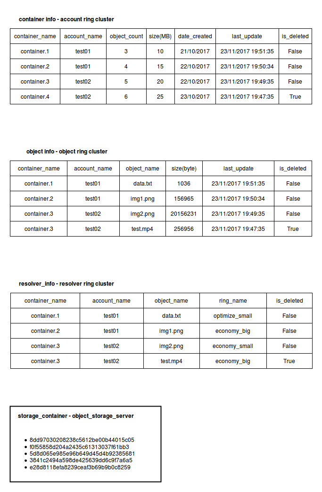

# Thiết kế cơ chế xử lý yêu cầu tạo Data Object mới

## Môi trường hệ thống

Trên hệ thống, ngoài dữ liệu của hệ thống (Ring và Trạng thái cac cluster) hiện có 4 kiểu dữ liệu của người dùng là:

- Data Object ( chứa trên các Object Storage Server)
- Resolver Information ( là các bảng **Resolver Information** nằm trên các cluster của **Object Resolver** Ring) 
- Object Information (là các bảng **Object Information** nằm trên các cluster của **Container** Ring) 
- Container Information (là các bảng **Container Information** nằm trên các cluster của **Account** Ring) 

Các kiểu dữ liệu Resolver Information, Object Information, Container Information lưu tại các bảng trên các cluster tương ứng với ring, có định dạng như sau:



Data Object là các Data Object lưu trong các Container của các Object Storage Server tương ứng với các Cluster. Tên file lưu trong Data Object là mã MD5 của ```tên file+'_'+ tên container+'_'+tên object```
('_' là ký tự đặc biệt)

Với hệ thống có: m cluster trong Account Ring, n cluster trong Container Ring, p cluster trong Object Resolver Ring thì sẽ có m bảng **Container Information**, n bảng **Object Information** và p bảng **Resolver Information** tương ứng với các cluster đó, và dữ liệu ở các bảng này sẽ không giống nhau, mà còn phụ thuộc vào các cluster chứa các bảng đó được những partition nào trên Ring tham chiếu tới.


Xét 1 trường hợp, Object ring bao gồm 4 cluster CAL-1, CAL-2, CAL-3, CAL-4 và đang có 3 partition 101,102,103 trên ring có chứa dữ liệu của 3 container 101-```container.1```, 102-```container.2``` và 103-```container.3```. Partition 101 tham chiếu tới các cluster CAL-1, CAL-2, CAL-3. Partition 102 tham chiếu tới các cluster CAL-2, CAL-3, CAL-4. Partition 103 tham chiếu tới các cluster CAL-1, CAL-3, CAL-4. 

Lúc này, khi ở trạng thái đồng bộ, dữ liệu về container trên hệ thống như sau:

## Cơ chế xử lý Upload File

- Mô hình nhất quán sử dụng: Eventualy consistency.
- Đảm bảo về độ nhất quán của dữ liệu: sau thời gian **t**s - được gọi là consistency window, các bản sao của các đối tượng dữ liệu sẽ được tiến hành đồng bộ dữ liệu với nhau. Tức là, đối với 1 đối tượng dữ liệu x nào đó, nếu không có thay đổi nào tới x được tạo ra trên hệ thống, thì dần dần theo thời gian thông tin tại các bản sao của x sẽ được đồng bộ với nhau

Cơ chế: 

- Khi người dùng gửi request Upload File - Data Object mới lên hệ thống, hệ thống sẽ tìm ra x1 các cluster trong Object Ring sẽ chứa các replica của Data Object mới, x2 các cluster trong Container Ring và x3 các cluster trong Resolver Ring chứa thông tin và thông tin định tuyến của Data Object mới. Hệ thống sẽ đồng thời gửi k request tới k cluster trên. Nếu ít nhất 2 cluster trong x1 cluster lưu Data Object mới, 2 trong số x2 các cluster lưu thông tin về data Object, và 2 trong số x3 các cluster lưu thông tin liên quan tới định tuyến của Data Object phản hồi lại thành công, hệ thống xác nhận Data Object mới đã được upload lên hệ thống. Các cluster không gửi lại phản hồi thành công vì một lý do nào đó (service quá tải, thất lạc message trên đường truyền, ...) sẽ chứa các thông tin cũ, và bước sau của cơ chế chỉ ra cách để cập nhật các thông tin cũ này.

- Sau **t** s consistency window, trên từng cluster trên hệ thống sẽ kiểm tra xem từng phần tử của các dữ liệu trên cluster (Resolver Info table, Container Info Table, Object Info Table, Object Container) đó đang ở trạng thái nào, và so sánh timestamp với các bản sao của phần tử đó ở các cluster khác thông qua các Ring. Nếu các bản sao ở các cluster khác "cũ hơn" bản sao đang xét , tiến hành gửi bản sao hiện tại tới cho cluster chứa bản sao bị cũ.

- Sau **t**s, các cluster thống kê lại thông tin về các Object trên các container ở bảng, sau đó gửi thông tin tổng hợp được tới các Cluster nằm trong Account Ring để cập nhật thông tin về các container - thông tin về các container có thể bị outdate trong **t** giây

## Cơ chế xử lý Update File

Cơ chế xử lý Update File tương tự như Upload File.

## Cơ chế xử lý Delete File

Cơ chế xử lý Delete File tương tự như Upload File, tuy nhiên dữ liệu gửi đi sẽ là Biến is_deleted = True kèm với time\_stamp của thao tác Delete File

## Ví dụ về tính eventually consistency của hệ thống

Dưới đây trình bày một số ví dụ về tính nhất quán trong hệ thống có thể xảy ra khi hệ thống hoạt động.

### Ví dụ về tính nhất quán khi thực hiện Upload File

Tại thời điểm **t0**, hệ thống tiến hành đồng bộ dữ liệu cho object storage - synchronize checkpoint.

Tại thời điểm **t1**, người dùng Upload 1 file có tên là **z** có nội dung **d1** lên hệ thống tại cluster A0. Thông qua định tuyến Ring, hệ thống xác định file **z** nằm trên các cluster A1, A2, A3. Trong lúc này, cluster A1 bị sự cố, chỉ có cluster A2 và cluster A3 nhận và phản hồi request cho A0. Do vậy A0 vẫn phản hồi cho người dùng File được upload thành công lên hệ thống. 

Sau đó, tại thời điểm **t2**, cluster A1 hoạt động trở lại. Lúc này dữ liệu về file **z** trên hệ thống như sau:

- A1: null
- A2: d1 - timestamp t1
- A3: d1 - timestamp t1

Sau đó, tại thời điểm **t3**, user gửi request đọc file x lên hệ thống. Vì lúc này cả 3 cluster reference bởi file **z** là A1, A2, A3 đều đang hoạt động, nên dữ liệu trả về cho người dùng sẽ là dữ liệu của 1 trong 3 cluster này (việc chọn cluster nào trong 3 cluster này là ngẫu nhiên). Nếu dữ liệu được đọc từ cluster A1, người dùng sẽ nhận được là null - HTTP 404 Not Found. Nếu dữ liệu được đọc từ A2 hoặc A3 thì người dùng sẽ nhận được response là **d1**. Hay nói cách khác, tại thời điểm này xác xuất hệ thống trả về dữ liệu của **z** là null là 1/3, xác suất hệ thống trả về dữ liệu của **z** là **d1** là 2/3

Tại thời điểm **t0+x**, hệ thống tiến hành đồng bộ lần tiếp theo, cluster A3 check timestamp của file **z**, sau đó nó truy vấn timestamp của file x tại cluster A1 và cluster A2. A2 trả về timestamp == timestamp của A3, còn A1 trả về null. Do đó A3 gửi dữ liệu **d1** của file **z** tới A1, A1 tiến hành cập nhật dữ liệu cho file **z**. Sua thời điểm **t0+x**, dữ liệu về file **z** trên 3 cluster mà **z** tham chiếu tới đồng bộ với nhau:

- A1: d1 - timestamp t1
- A2: d1 - timestamp t1
- A3: d1 - timestamp t1

### Ví dụ về tính nhất quán khi thực hiện Update File

Xét 1 file có tên là **y** đang được lưu trữ trên hệ thống tại 3 cluster A1, A2, A3. Tại thời điểm **t0**, hệ thống tiến hành đồng bộ dữ liệu cho object storage - synchronize checkpoint, sau thời điểm này, **y** có nội dung là **d2** ở cả 3 cluster:

- A1: d2 - timestamp t0
- A2: d2 - timestamp t0
- A3: d2 - timestamp t0

Tại thời điểm **t1**, người dùng Update **y** với nội dung mới là **d3** lên hệ thống tại cluster A0. Thông qua định tuyến Ring, hệ thống xác định file **y** nằm trên các cluster A1, A2, A3. Trong lúc này, cluster A1 bị sự cố, chỉ có cluster A2 và cluster A3 nhận và phản hồi request cho A0. Do vậy A0 vẫn phản hồi cho người dùng File được upload thành công lên hệ thống. 

Sau đó, tại thời điểm **t2**, cluster A1 hoạt động trở lại. Lúc này dữ liệu về file **y** trên hệ thống như sau:

- A1: d2 - timestamp t0
- A2: d3 - timestamp t1
- A3: d3 - timestamp t1

Sau đó, tại thời điểm **t3**, user gửi request đọc file y lên hệ thống. Vì lúc này cả 3 cluster reference bởi file **y** là A1, A2, A3 đều đang hoạt động, nên dữ liệu trả về cho người dùng sẽ là dữ liệu của 1 trong 3 cluster này (việc chọn cluster nào trong 3 cluster này là ngẫu nhiên). Nếu dữ liệu được đọc từ cluster A1, người dùng sẽ nhận được là **d2** - timestamp t0. Nếu dữ liệu được đọc từ A2 hoặc A3 thì người dùng sẽ nhận được response là **d3** - timestamp t1.

Tại thời điểm **t0+x**, hệ thống tiến hành đồng bộ lần tiếp theo, cluster A3 check timestamp của file **y**, sau đó nó truy vấn timestamp của file **y** tại cluster A1 và cluster A2. A2 trả về timestamp == timestamp của A3, còn A1 trả về ```t0<t1```. Do đó A3 gửi dữ liệu **d3** của file **y** tới A1, A1 tiến hành cập nhật dữ liệu cho file **y**. Ngược lại, nếu A1 truy vấn timestamp của A2 và A3, nó sẽ nhận được timestamp **t1** lớn hơn timestamp hiện tại **t0** của **y** mà A1 đang lưu trữ, nên A1 sẽ không gửi request cập nhật dữ liệu tới A2 và A3. Vì vậy, sau thời điểm **t0+x**, dữ liệu về file **y** trên 3 cluster mà **y** tham chiếu tới đồng bộ với nhau:

- A1: d3 - timestamp t1
- A2: d3 - timestamp t1
- A3: d3 - timestamp t1

Quá trình đồng bộ và tính nhất quán của dữ liệu trong trường hợp delete file tương tự như trong trường hợp Update File.